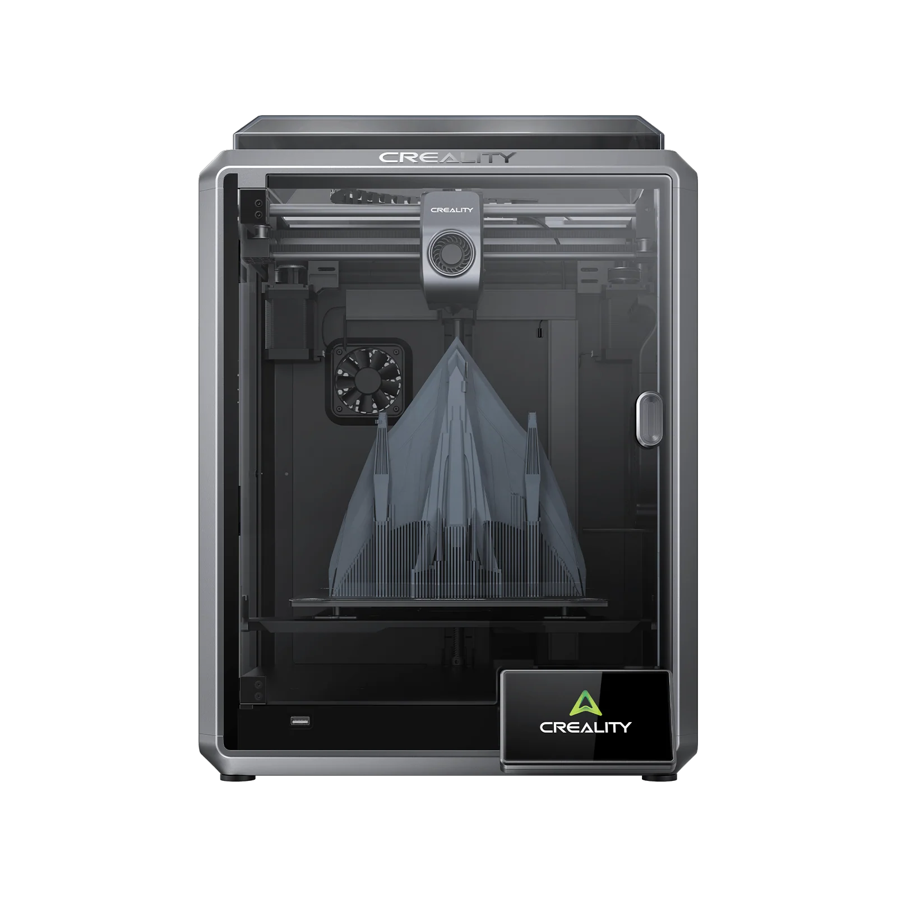
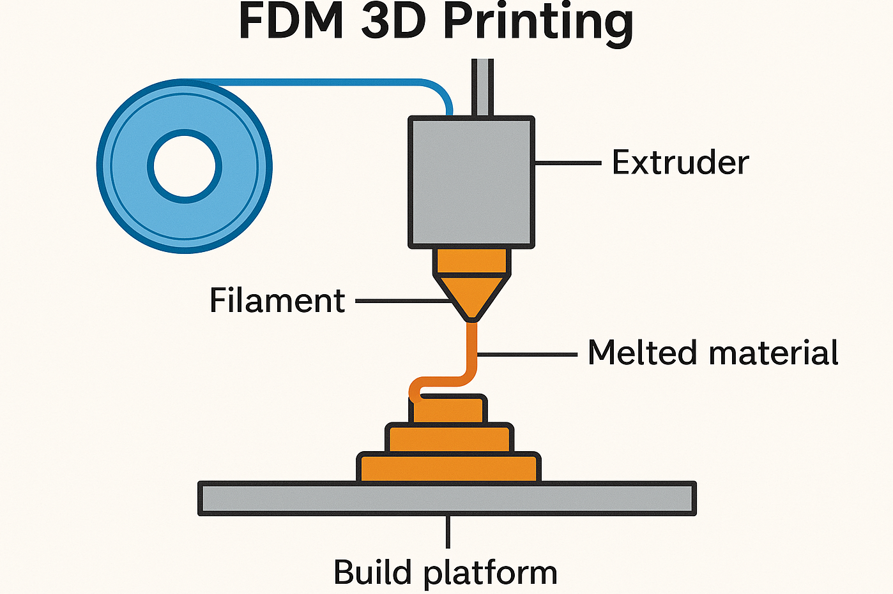
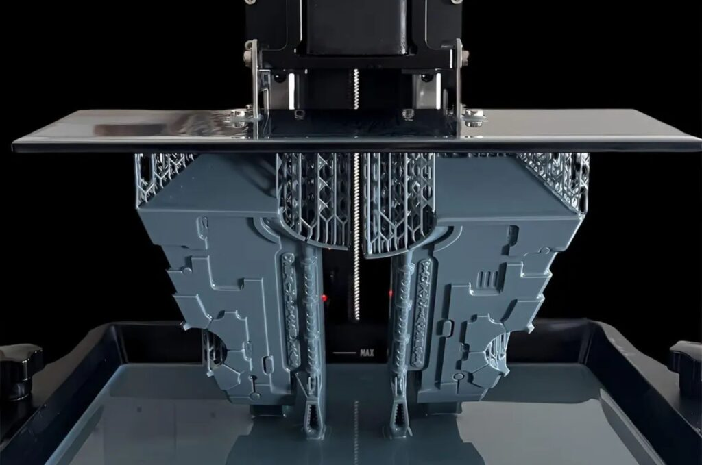
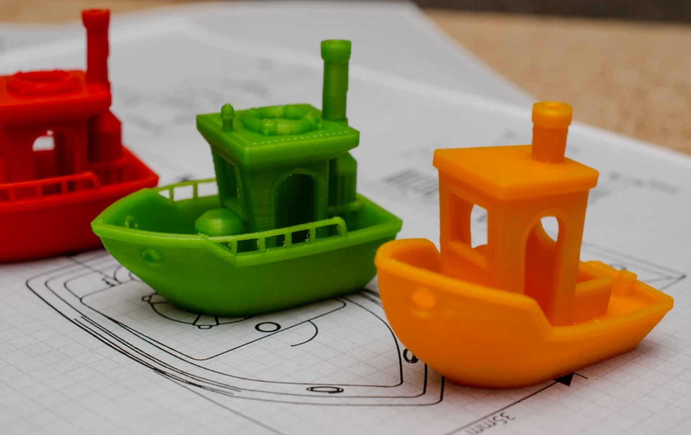
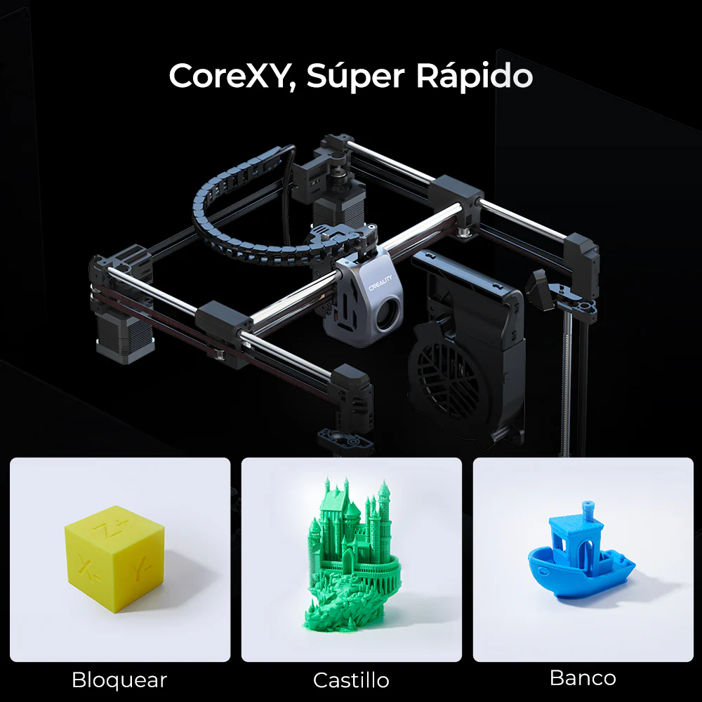
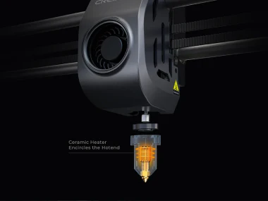
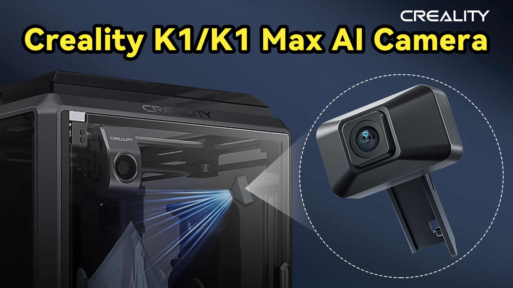

# 📑 Módulo 1: Impresión FDM y Hardware

La **Creality K1** no es solo una impresora 3D; es un ecosistema diseñado para que la creatividad no tenga que esperar. En el ámbito educativo, el tiempo es el recurso más valioso, y la K1 responde a esta necesidad con una velocidad de impresión hasta **12 veces superior** a las impresoras convencionales.

**¿Qué hace special a la Serie K?**

* **Rápida, Inteligente y Súper:** Así se define la experiencia con la K1 Max y la K1, optimizando los tiempos de clase.
* **Tecnología CoreXY:** Su estructura robusta permite movimientos precisos a velocidades increíbles sin sacrificar la calidad de las capas.
* **Inteligencia Artificial (IA):** Equipada con sensores y cámaras que supervisan la impresión, garantizando una nivelación de cama perfecta y detectando errores antes de que arruinen el trabajo de un alumno.
* **Ecosistema Integrado:** Desde el diseño en **Creality Cloud** hasta la fabricación física, todo está conectado para facilitar la gestión docente.

  

**Objetivo del Módulo**

En esta sección, aprenderemos a identificar cada parte de la impresora, realizaremos la primera configuración guiada y estableceremos protocolos de seguridad para que el aula sea un espacio de innovación sin riesgos.

---

> **Dato:** La Creality K1 puede imprimir un modelo estándar de prueba (Benchy) en solo **11 minutos y 40 segundos**, cuando en impresoras convencionales tardaría horas. ¡Ideal para demostraciones rápidas en una sesión de 50 minutos!

## 1.1. Fundamentos: ¿Qué es la impresión FDM?
Antes de operar la máquina, es esencial comprender la tecnología que utiliza: el **Modelado por Deposición Fundida (FDM)**.

* **El Concepto**: Imagine una "manga pastelera robótica" que deposita material capa sobre capa para construir un objeto con volumen.

  

* **El Proceso en 3 pasos**:
    
    1. **Extrusión**: Un motor empuja el filamento sólido hacia una boquilla caliente (nozzle).  
    2. **Fusión**: El plástico se funde (normalmente entre 200°C y 240°C) y sale en un hilo finísimo.  
    3. **Solidificación**: Al contacto con el aire o la capa anterior, el plástico se enfría y se endurece instantáneamente, creando una estructura sólida.  

* **Capas e Infill**: Los objetos no se imprimen "macizos"; para ahorrar tiempo y material, la FDM crea una cáscara externa sólida y un relleno interno en forma de rejilla llamado Infill.

### 1.1.1. Otras Tecnologías de Impresión 3D

Aunque la Creality K1 utiliza la tecnología FDM (la más común en el aula por su seguridad y coste), existen otros tipos de impresión 3D que funcionan bajo principios físicos diferentes. Los dos más relevantes para conocer el panorama completo son:

* **Fotopolimerización de Resina** (SLA / DLP / MSLA)
En lugar de fundir un hilo de plástico, estas impresoras utilizan una resina líquida fotosensible que se endurece al entrar en contacto con una fuente de luz (láser o pantalla UV).

Cómo funciona: La plataforma de impresión se sumerge en un tanque de resina y una luz proyecta la forma de la capa, solidificándola instantáneamente.

Ventaja: Ofrecen una resolución extrema, casi invisible al ojo humano. Son ideales para miniaturas, joyería o piezas dentales.

Desventaja en el aula: Requieren un manejo delicado de productos químicos, limpieza con alcohol isopropílico y un post-curado con luz UV.

  

* **Sinterizado Selectivo por Láser** (SLS)
Es la tecnología estándar en la industria pesada y aeroespacial.

Cómo funciona: Utiliza un material en polvo (normalmente nailon). Un láser de alta potencia barre la superficie del polvo, fundiendo las partículas y uniéndolas.

Ventaja: No necesita estructuras de soporte, ya que el propio polvo no fundido sostiene la pieza mientras se imprime. Permite crear geometrías imposibles para la K1.

Desventaja: Las máquinas son extremadamente costosas y requieren entornos industriales controlados.

* **Impresión 3D de Metal** (DMLS / SLM)
Similar al SLS, pero utilizando polvo de metales como acero, titanio o aluminio. Es el nivel más avanzado de fabricación aditiva, utilizado para crear piezas finales de motores o implantes médicos.

Dato: La Creality K1 puede imprimir un **modelo estándar de prueba** (conocido como el barco **Benchy**) en solo 11 minutos y 40 segundos, cuando en impresoras convencionales tardaría horas. ¡Ideal para demostraciones rápidas en una sesión de 50 minutos!.

  

## 1.2. Anatomía de la K1: Tecnología CoreXY y velocidad extrema

La Creality K1 no es una impresora 3D convencional (cartesiana); es una máquina diseñada bajo una arquitectura de alto rendimiento. En este apartado analizamos los componentes físicos que permiten que un proyecto que antes tardaba 10 horas se complete en poco más de una hora de clase.

---

#### A. Arquitectura CoreXY: El secreto de la agilidad

A diferencia de las impresoras "camas calientes" (donde la base se mueve hacia adelante y atrás), en la K1 la cama solo se mueve verticalmente (eje Z).

* **Motores fijos:** Los motores de los ejes X e Y están anclados al chasis. Esto reduce drásticamente el peso del cabezal móvil.
* **Sincronización:** Mediante un sistema de correas cruzadas, ambos motores trabajan juntos para mover el cabezal. Menos peso significa menos inercia, permitiendo aceleraciones de $20.000mm/s^2$. 
* **Ventaja educativa:** Menor vibración y mayor precisión, lo que se traduce en piezas con mejor acabado en una fracción del tiempo habitual.

  

## B. El Sistema de Extrusión "Sprite" y Hotend de Alto Flujo

Para imprimir a **600 mm/s**, la impresora debe ser capaz de fundir y empujar plástico de forma masiva y constante.

* **Extrusor Directo:** El motor de empuje está justo encima de la boquilla. Esto ofrece un control absoluto sobre el filamento, eliminando el retraso (lag) de los sistemas antiguos.
* **Calentador Cerámico de 360°:** Envuelve el hotend para alcanzar los **200°C en unos 40 segundos**.
* **Caudal Volumétrico:** La K1 puede procesar hasta **32 $mm^3$** de plástico por segundo. Sin este flujo, la impresora se movería rápido pero no saldría material (sub-extrusión).

  

## C. Refrigeración Activa Dual

La velocidad extrema requiere un enfriado inmediato del plástico para que no se deforme.

1. **Ventilador del cabezal:** Enfría el material justo cuando sale de la boquilla.
2. **Ventilador lateral de 18W:** Un gran ventilador situado en el lateral de la cámara que crea un flujo de aire constante sobre la pieza. Esto permite imprimir "puentes" (partes al aire) casi sin necesidad de soportes.

  

## D. Estructura Robusta (Die-cast)

El chasis está fabricado en una sola pieza de aleación de aluminio fundido a presión mediante control numérico (CNC).

* **Rigidez:** Esta solidez es la que evita que la impresora "baile" o se desplace por la mesa debido a los movimientos violentos del cabezal a alta velocidad.

---

> **Resumen:** La tecnología CoreXY de la K1 no es solo "marketing de velocidad"; es la capacidad de convertir un diseño digital en un objeto real dentro de la misma jornada escolar, algo que con tecnologías anteriores era logísticamente imposible.
>
## 1.3. Unboxing y Configuración: Nivelación automática y preparación de la cama

Una vez comprendida la mecánica, el siguiente paso es la puesta en marcha. La **Creality K1** destaca por su facilidad de inicio, eliminando las calibraciones manuales tediosas que solían frustrar a los usuarios noveles.

---

### A. El Proceso de Desembalaje (Unboxing Crítico)
La impresora llega premontada, pero existen pasos de seguridad obligatorios para evitar daños mecánicos inmediatos:

* **Retirada de tornillos de fijación:** La base (cama caliente) viene bloqueada con **3 tornillos (marcados con etiquetas amarillas)** para que no se mueva durante el transporte. Es vital retirarlos con la llave Allen incluida antes de conectar la máquina.
* **Inspección del Voltaje:** Verificar que el interruptor de la fuente de alimentación (situado en la parte posterior o lateral) esté en **230V** (para España/Europa).

### B. Autonivelación "Hands-free" (Sin manos)
Olvídese del papel y los tornillos manuales. La K1 gestiona la superficie de impresión de forma inteligente:

* **Sensores de deformación (Strain Gauges):** Bajo la cama, la impresora tiene sensores que detectan el contacto físico exacto de la boquilla con la superficie.
* **Malla de Nivelación:** La máquina toca diversos puntos de la base para crear un mapa digital del relieve. Si la base está ligeramente inclinada, la impresora lo compensará en tiempo real moviendo el eje Z durante la impresión.
* **Z-Offset Automático:** La distancia crítica entre la boquilla y la cama se calcula sola, garantizando que la primera capa siempre tenga la adherencia correcta.

### C. Preparación de la Cama (Placa PEI)
La K1 incluye una placa de acero flexible con revestimiento de **PEI rugoso**:

* **Adherencia Térmica:** La mayoría de los materiales (PLA, PETG) se adhieren perfectamente solo con el calor de la base.
* **Flexión para despegue:** Una vez terminada la impresión y enfriada la base (por debajo de 35°C), simplemente doble ligeramente la placa y la pieza saltará sola.
* **Limpieza:** Para mantener la efectividad, limpie la placa periódicamente con **alcohol isopropílico** o agua y jabón neutro para eliminar la grasa de las huellas dactilares.

### D. Autoprueba de Resonancia (Input Shaping)
Durante la configuración inicial, la impresora realizará una serie de movimientos rápidos que generan un sonido vibratorio fuerte:

* **¿Qué está haciendo?** Mide las frecuencias de vibración de su propia estructura.
* **Resultado:** El software aprende a "adelantarse" a esas vibraciones para cancelarlas, permitiendo que la impresión sea nítida incluso a 600 mm/s.

---

> **Consejo para el Aula:** Realice la configuración inicial en un momento en que los alumnos puedan observar el proceso de "Autoprueba". Es una excelente oportunidad para explicar conceptos físicos como la **frecuencia de resonancia** y la **compensación de errores por software**.

## 1.4. Actualizaciones Críticas: Gestión de Firmware vía OTA y USB

En la Creality K1, el **firmware** no es solo un software de control; es el motor que optimiza la calidad de impresión y la seguridad. Mantenerlo actualizado es vital para corregir errores de nivelación y mejorar la compatibilidad con el ecosistema de software.

---

### A. ¿Por qué actualizar el firmware en un entorno escolar?
Las actualizaciones periódicas de Creality para la serie K-Series suelen incluir:

* **Optimizaciones de IA:** Mejora la precisión de la cámara para detectar fallos (como el "efecto espagueti").
* **Mejoras en el algoritmo de nivelación:** Refina el cálculo del mapa de la superficie para asegurar adherencias perfectas.
* **Corrección de Bugs:** Soluciona posibles errores de lectura de archivos o desconexiones Wi-Fi.

### B. Método 1: Actualización vía OTA (Online)
Es el método más directo y recomendado si la impresora tiene acceso a internet:

1.  **Conexión:** Asegúrese de que la K1 esté conectada a la red Wi-Fi del centro.
2.  **Ruta:** En la pantalla táctil, vaya a **Settings (Ajustes)** > **Check for Updates (Buscar actualizaciones)**.
3.  **Descarga:** Si hay una versión disponible, aparecerá una notificación. Pulse "Download" y, una vez finalizada, "Update". La máquina se reiniciará automáticamente.

### C. Método 2: Actualización vía USB (Offline)
Ideal para centros educativos con restricciones de red o sin conexión Wi-Fi:

1.  **Descarga:** Acceda al [Centro de Descargas de Creality](https://www.creality.com/download) desde un ordenador y descargue el archivo oficial más reciente (formato `.img`).
2.  **Preparación:** Copie el archivo directamente en la raíz de un pendrive USB (formateado en FAT32).
3.  **Instalación:** Inserte el pendrive en el puerto USB frontal de la K1. La impresora detectará el archivo de firmware y preguntará si desea actualizar. Confirme y espere a que termine el proceso.

### D. Notas de Seguridad tras la Actualización
* **No apagar:** Nunca interrumpa la alimentación eléctrica durante una actualización, ya que podría corromper el sistema operativo interno.
* **Recalibración:** Tras un cambio de firmware importante, es altamente recomendable realizar de nuevo el **Self-test (Autoprueba)** de nivelación e *Input Shaping* para asegurar que los nuevos parámetros se apliquen correctamente a la mecánica de la máquina.

---

> **Recomendación Directa:** Establezca un calendario trimestral de revisión de firmware. Esto garantiza que el profesorado trabaje siempre con la versión más estable y con las funciones de seguridad de la cámara IA totalmente optimizadas.

## 1.5. Seguridad y Entorno: Uso de la cámara cerrada y monitoreo con IA

La Creality K1 ha sido diseñada como una máquina "encerrada", lo que proporciona ventajas críticas de seguridad y estabilidad en el entorno escolar frente a las impresoras abiertas tradicionales.

---

### A. Ventajas de la Cámara Cerrada en el Aula
El chasis totalmente cerrado no es solo una cuestión estética; cumple tres funciones fundamentales para el docente:

* **Seguridad Física:** Evita que los alumnos puedan introducir las manos y tocar partes móviles o el hotend, el cual opera a temperaturas de hasta **300°C**.
* **Estabilidad Térmica:** Protege la impresión de corrientes de aire externas (aires acondicionados o apertura de ventanas), lo que previene el **warping** (contracción y despegue de las esquinas de la pieza).
* **Gestión de Emisiones:** La K1 incluye un extractor con **filtro de carbón activo**. Este sistema filtra las partículas y olores generados durante la fundición del plástico, manteniendo un ambiente de trabajo más saludable en el aula.

### B. Monitoreo Inteligente con Cámara IA
La K1 permite la instalación de una cámara HD (incluida de serie en la K1 Max) que se integra con el software de la impresora para ofrecer funciones de supervisión avanzada:

* **Detección de Fallos (Spaghetti Detection):** Mediante algoritmos de IA, la impresora identifica si una pieza se ha despegado y está generando hilos de plástico sin control. En ese caso, pausa la impresión y envía una notificación, evitando el desperdicio de filamento.
* **Detección de Objetos Extraños:** La cámara escanea la superficie antes de empezar para asegurar que no haya piezas olvidadas de impresiones anteriores o herramientas que puedan causar una colisión.
* **Supervisión Remota:** El docente puede vigilar el progreso desde su ordenador o móvil a través de **Creality Cloud** o la red local, sin necesidad de desplazarse físicamente a la ubicación de la impresora.

  

### C. Gestión de Residuos y Entorno de Trabajo
Para un uso responsable en el centro educativo, se deben seguir estas pautas:

* **Purga de Material:** Antes de cada impresión, la K1 realiza una línea de purga. Es necesario retirar estos restos regularmente para evitar que interfieran con la siguiente pieza.
* **Mantenimiento de la Tapa Superior:** Al imprimir con **PLA**, se recomienda retirar la tapa superior de cristal o dejarla entreabierta si la temperatura ambiente es muy alta (más de 30°C), para evitar que el calor excesivo dentro de la cámara ablande el filamento antes de llegar al extrusor (heat creep).

### D. Grabación de Time-lapses
La cámara genera automáticamente videos acelerados del proceso de creación. Este recurso es de gran valor didáctico para:

* Documentar proyectos de ingeniería.
* Compartir el progreso de los trabajos en redes sociales del centro o presentaciones de clase.
* Analizar fallos mecánicos revisando en qué punto exacto falló la estructura.

[Ver vídeo](https://youtu.be/QkQPaXEcI0M?si=nTfaoyPiPoUDMiux)

<iframe width="560" height="315" 
src="https://youtu.be/QkQPaXEcI0M?si=nTfaoyPiPoUDMiux" 
frameborder="0" 
allowfullscreen>
</iframe>

<iframe width="560" height="315" src="https://www.youtube.com/embed/pAbg3UA2K6M?si=YN_h20-ehRBog_Fw" title="YouTube video player" frameborder="0" allow="accelerometer; autoplay; clipboard-write; encrypted-media; gyroscope; picture-in-picture; web-share" referrerpolicy="strict-origin-when-cross-origin" allowfullscreen></iframe>
---

> **Nota de Seguridad:** Aunque la máquina sea cerrada, siempre se debe supervisar el inicio de la primera capa. Una vez confirmada la adherencia, la IA y la cámara pueden hacerse cargo del monitoreo.
