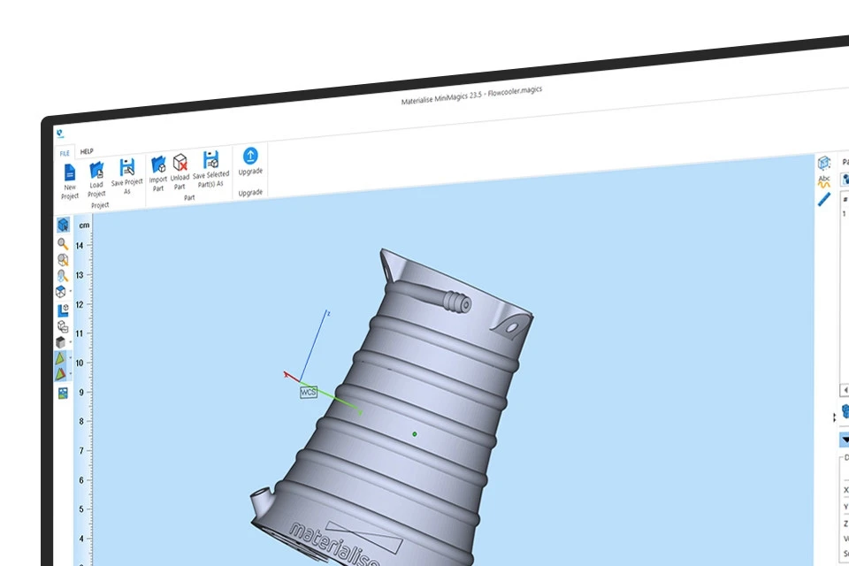
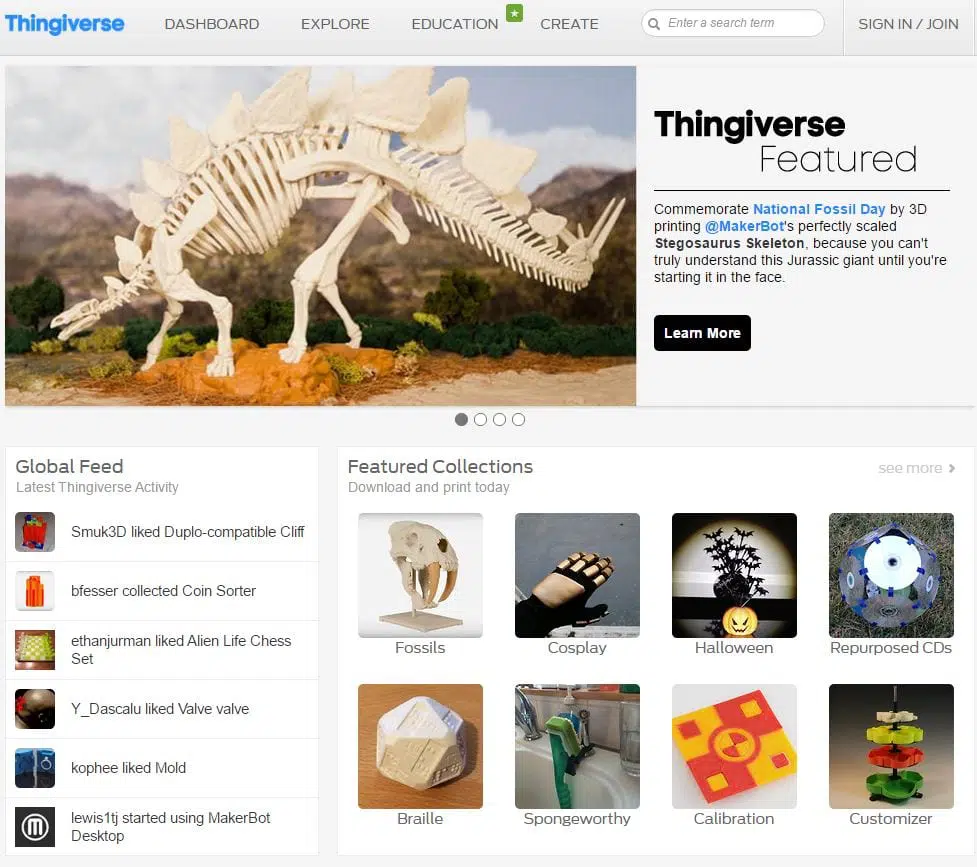
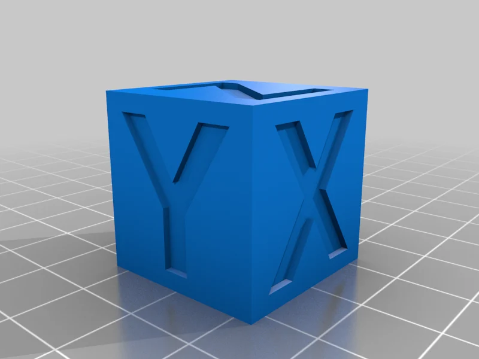
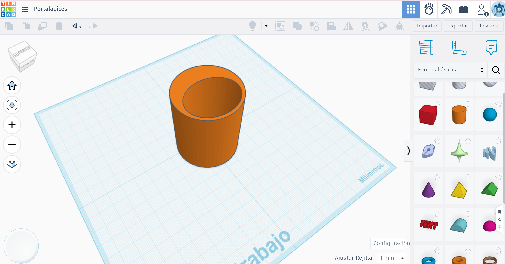

# Módulo 2: Diseño y Obtención de Modelos 3D

Este módulo se centra en el origen de la pieza: la generación del archivo digital. Antes de llegar a la impresora, el docente debe dominar las herramientas que permiten transformar una idea pedagógica en un objeto tangible, ya sea localizando recursos existentes o diseñando soluciones propias.

  

---

## Introducción: La democratización del diseño 3D

El éxito pedagógico con la **Creality K1** no reside solo en su velocidad, sino en la capacidad de generar contenido relevante para el currículo. Este bloque actúa como el motor creativo del curso, eliminando la barrera de "no sé qué imprimir" a través de dos estrategias complementarias:

1.  **Curación y Repositorios:** No es necesario diseñar cada pieza desde cero. Aprenderemos a navegar por bibliotecas globales para encontrar modelos educativos ya probados, evaluando su calidad y su idoneidad para la impresión de alta velocidad.
2.  **Modelado Intuitivo:** Introduciremos herramientas que permiten a los alumnos (y docentes) crear sus propios modelos. Desde la simplicidad de bloques de **Tinkercad** hasta la precisión técnica de **Onshape**, el objetivo es que el diseño se convierta en una extensión del pensamiento del estudiante.
3.  **Compatibilidad y Formatos:** Entenderemos el "lenguaje" de la fabricación aditiva. Aprenderemos por qué el archivo **.STL** es el estándar de oro y cómo asegurar que nuestros diseños sean técnicamente viables para evitar fallos de impresión.

## Objetivos del Módulo
* Identificar y filtrar recursos de calidad en repositorios como **Creality Cloud**, **Thingiverse** y **Printables**.
* Diferenciar las herramientas de diseño (Tinkercad, SketchUp, Onshape) según la edad del alumnado y el objetivo del proyecto.
* Dominar las reglas básicas de diseño para impresión 3D (voladizos, tolerancias y estabilidad).
* Exportar correctamente los modelos para garantizar una transición fluida hacia el software de laminado.

---

## 2.1. Tabla Comparativa: Software de Diseño según Nivel Educativo

Esta tabla ayudará a los docentes a seleccionar la herramienta más adecuada para sus alumnos, optimizando el tiempo de aprendizaje en el aula.

| Herramienta | Nivel Sugerido | Curva de Aprendizaje | Fortalezas | Formato de Salida |
| :--- | :--- | :--- | :--- | :--- |
| **Tinkercad** | Primaria / ESO (12-14 años) | 🟢 Muy Baja | Intuitivo, basado en bloques geométricos. Ideal para conceptos básicos de volumen. | .STL, .OBJ |
| **SketchUp** | ESO / Bachillerato | 🟡 Media | Muy visual para arquitectura, mobiliario y diseño de espacios. Requiere extensión para STL. | .SKP, .STL |
| **Onshape** | Bachillerato / FP / Universidad | 🔴 Alta | Profesional, paramétrico (medidas exactas) y colaborativo en la nube. | .STL, .STEP, .PARASOLID |

  

---

## 2.2. Curación de Contenidos: ¿Dónde y qué buscar?

No todos los modelos que vemos en internet son aptos para la **Creality K1**, especialmente si queremos imprimir a alta velocidad.

### Principales Repositorios
1.  **Creality Cloud:** La opción nativa. Permite laminar en la nube y enviar directamente a la K1. Muy útil para gestión desde tabletas.
2.  **Printables (de Prusa):** Actualmente es el estándar de calidad. Los modelos suelen incluir fotos reales de la pieza impresa y consejos de configuración.
3.  **Thingiverse:** El más grande y clásico, ideal para encontrar material didáctico de ciencias (maquetas de ADN, piezas mecánicas, etc.).
4.  Cults, MyMiniFactory, Pinshape: Otros repositorios con modelos de alta calidad, aunque menos orientados a la educación.

   

### Checklist de Calidad (Reglas de Oro)
Antes de descargar, el docente debe enseñar al alumno a observar:

* **Base de apoyo:** ¿Tiene una superficie plana suficientemente grande para pegarse a la cama magnética de la K1?
* **Voladizos (Overhangs):** ¿Hay partes "flotando" en el aire que requieran soportes? 
* **Manifold (Modelo Sólido):** Asegurarse de que el modelo no tenga "agujeros" en su malla, o el laminador dará errores.

---

## 2.3. Reglas de Diseño para Fabricación Aditiva (DFM)

Para maximizar el éxito en la K1, debemos diseñar pensando en cómo imprime la máquina:

* **La Regla de los 45°:** Cualquier ángulo mayor a 45° respecto a la vertical probablemente necesite soportes. Diseñar piezas autoportantes ahorra material y tiempo.
* **Tolerancias:** Si dos piezas deben encajar (ej. un eje en un agujero), debemos dejar un margen de diseño (normalmente entre **$0.15mm$** y **$0.3mm$**) debido a la expansión térmica del filamento.
* **Orientación de impresión:** Diseñar la pieza pensando en cuál será su cara de apoyo para minimizar el post-procesado.

---

## 🛠️ Ejercicios Prácticos

Para consolidar el flujo de trabajo digital, realizaremos dos actividades complementarias. La primera se basa en la **edición** y la segunda en la **creación original**.

### Ejercicio A: "Remix Educativo" (Del Repositorio a la Modificación)
Este ejercicio enseña a los alumnos que el contenido online es un punto de partida, no un final.

1.  **Búsqueda:** Localizar en **Thingiverse** o **Printables** un "Cubo de calibración" básico $20x20x20$ mm.
2.  **Importación:** Subir el archivo `.STL` descargado a **Tinkercad**.
3.  **Personalización:** Utilizar la herramienta de **Texto en modo "Hueco"** para grabar las iniciales del alumno o el nombre del centro educativo en una de las caras superiores.
4.  **Exportación:** Descargar el resultado final como un nuevo archivo `.STL`.
   
!!! note "Cubo de calibración"

    El **Cubo de Calibración** es una pieza de prueba de $20 \times 20 \times 20$ mm que sirve como **diagnóstico rápido** de la impresora. Sus tres funciones principales son:

    1.  **Verificar Medidas (Precisión):** Se usa un calibre para comprobar que los ejes **X, Y y Z** miden exactamente $20$ mm. Si mide menos, la pieza final no encajará.
    2.  **Ajustar el Material (Extrusión):** Sirve para ver si la impresora suelta demasiado plástico (bordes rugosos) o muy poco (huecos entre capas).
    3.  **Control de Velocidad:** En la **Creality K1**, ayuda a detectar si la vibración por imprimir a $600$ mm/s genera defectos visuales (como "sombras" o ecos en las letras).

> **Resumen:** Es el "examen médico" de la impresora. Si el cubo sale bien, el resto de tus piezas también saldrán bien.

  

---

### Ejercicio B: "Diseño de Precisión" (Creación desde cero en Tinkercad)
Este ejercicio introduce el pensamiento espacial y el cumplimiento de las reglas **DFM** (Diseño para Fabricación).

* **Reto:** Diseñar un **Soporte para Bolígrafos de Escritorio** que no necesite soportes (autoportante).
* **Pasos:**
    1.  Arrastrar un **Cilindro** al plano de trabajo y escalarlo a $50$ mm de diámetro y $60$ mm de altura.
    2.  Utilizar un segundo cilindro (como "Hueco") de $44$ mm de diámetro para vaciar el interior, dejando una pared de $3$ mm (ideal para la boquilla de la K1).
    3.  **Aplicar la Regla de los 45°:** Añadir detalles decorativos en las paredes exteriores usando prismas o pirámides, asegurándose de que ninguna pieza sobresalga en el aire sin apoyo.
    4.  **Verificación:** Comprobar que la base es perfectamente plana para garantizar la adherencia en la K1.
    5.  **Exportación:** Generar el archivo `.STL` final para el siguiente módulo.

  

---