# Módulo 3: Ecosistema de Software y Gestión de Aula

Este módulo traslada el enfoque de la máquina física al entorno digital. El éxito de la **Creality K1** en el aula depende de una correcta preparación de los archivos y de la capacidad del docente para gestionar el flujo de trabajo de múltiples alumnos de forma eficiente.

---

## Introducción: Del modelo digital a la realidad física

El ecosistema de software de la K1 está diseñado para ser un puente invisible. No se trata solo de "laminar" (convertir un diseño en instrucciones para la impresora), sino de controlar, supervisar y optimizar. En el entorno educativo, esto se traduce en tres pilares fundamentales:

1.  **Simplicidad Operativa:** El software oficial (**Creality Print**) ya incluye perfiles optimizados. El docente no necesita ser un experto en parámetros de impresión; la inteligencia del software ya sabe cómo exprimir los 600 mm/s de la K1 con seguridad.
2.  **Gestión de Aula:** Mediante la conectividad en red y la nube, el profesor puede recibir proyectos, revisar errores antes de imprimir y gestionar la cola de trabajo sin necesidad de desplazarse con tarjetas SD o pendrives.
3.  **Supervisión Inteligente:** La integración de la IA y la cámara permite que el software actúe como un "asistente de taller", pausando la impresión si algo sale mal y notificando al docente en su escritorio.

## Objetivos del Módulo
* Dominar la interfaz de **Creality Print** para preparar modelos en tiempo récord.
* Comprender los parámetros críticos que afectan a la velocidad y la calidad en proyectos escolares.
* Implementar un flujo de trabajo basado en la nube (**Creality Cloud**) para organizar las entregas del alumnado.
* Utilizar las herramientas de monitorización para maximizar la tasa de éxito de las impresiones.

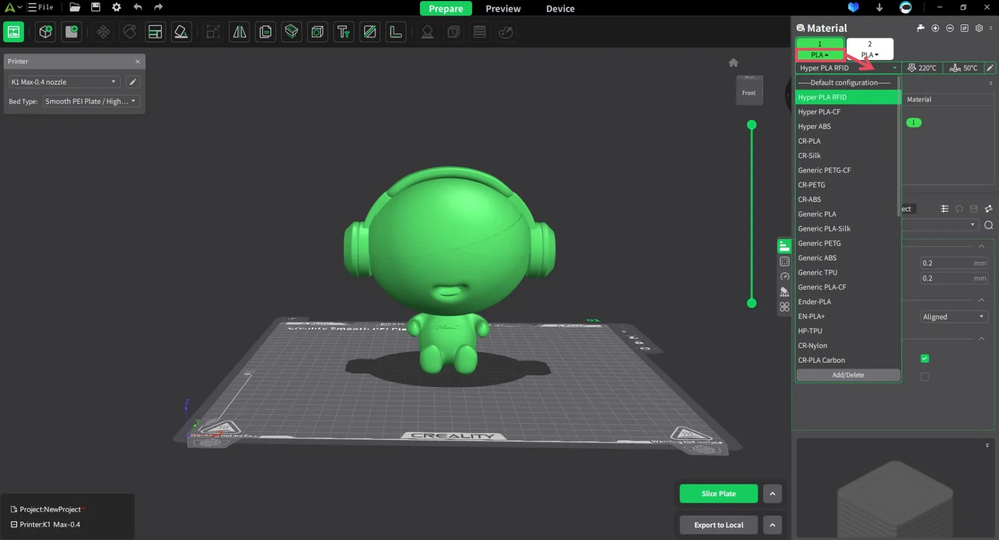  

---

> **Nota para el docente:** El software es donde realmente ahorramos tiempo. Una pieza mal laminada es una hora de clase perdida; una pieza bien configurada es un éxito rotundo que motiva al estudiante.

## 3.1. Creality Print: Configuración de perfiles y optimización de capas

**Creality Print** es el software de laminación (*slicer*) oficial diseñado específicamente para extraer el máximo potencial de la K1. A diferencia de otros laminadores genéricos, este incluye perfiles de ingeniería optimizados que equilibran la velocidad de 600 mm/s con la integridad estructural de las piezas.

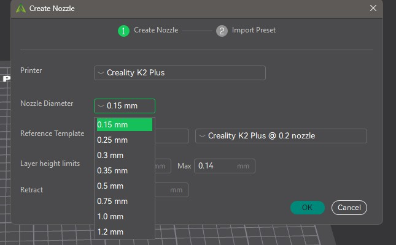  

---

#### A. Interfaz y Configuración de la Impresora
Al abrir el software por primera vez, el paso crítico es la selección correcta del modelo:

* **Selección de Máquina:** Debe seleccionarse estrictamente el modelo **K1** (o K1 Max). Esto carga automáticamente las dimensiones de la cama ($250 \times 250 \times 250$ mm) y los límites de aceleración del sistema CoreXY.

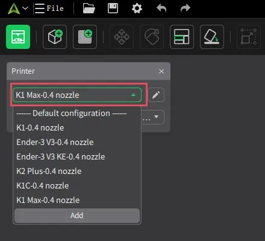  

* **Gestión de Boquilla:** El perfil estándar asume una boquilla de **0.4 mm**. Si para proyectos educativos de gran tamaño se decide cambiar a una boquilla de 0.6 mm o 0.8 mm, es imperativo cambiar el ajuste en el software para que el flujo de plástico sea coherente.

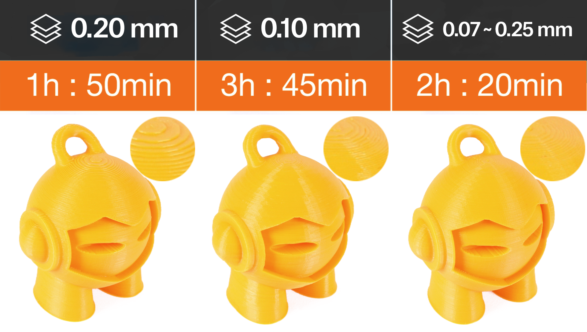  

**Alturas de capa recomendadas según nozzle/boquilla**

| Nozzle (mm) | Altura mínima (≈25%) | Altura óptima (≈50%) | Altura máxima (≈75%) | Uso típico |
|-------------|---------------------|----------------------|----------------------|------------|
| 0.4         | 0.10 mm             | 0.20 mm              | 0.30 mm              | Equilibrio calidad/tiempo |
| 0.6         | 0.15 mm             | 0.30 mm              | 0.45 mm              | Piezas funcionales, más rapidez |
| 0.8         | 0.20 mm             | 0.40 mm              | 0.60 mm              | Piezas grandes, muy rápido |

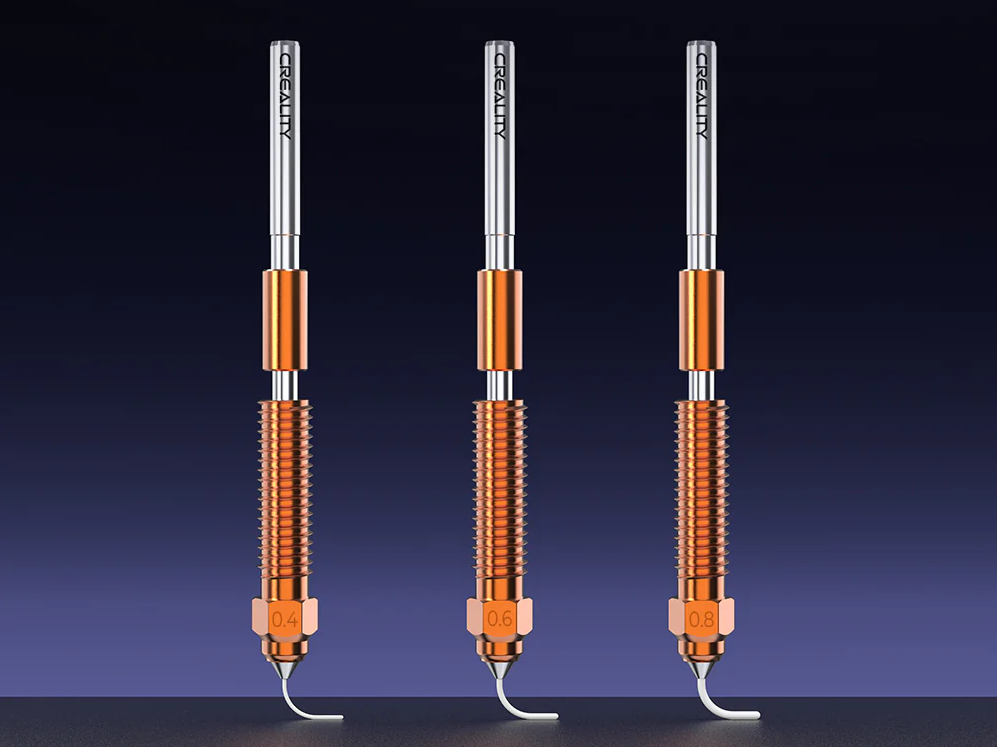  

#### B. Perfiles de Impresión (Presets)
El software ofrece tres niveles principales de calidad que el docente debe conocer para gestionar los tiempos de clase:

1.  **Normal (0.20 mm):** El estándar para la mayoría de proyectos STEM. Ofrece el mejor equilibrio entre estética y velocidad.
2.  **High Quality (0.10 mm):** Ideal para piezas con mucho detalle o encajes mecánicos precisos. Duplica el tiempo de impresión.
3.  **Fast / Draft (0.25 - 0.30 mm):** Perfecto para prototipos rápidos donde la estética no es prioritaria. Es el perfil recomendado para "probar" ideas en una sola sesión lectiva.

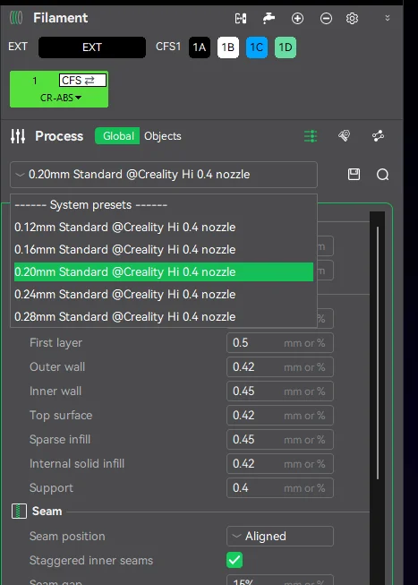  

#### C. Optimización de Capas: El concepto de "Capa Variable"
Una función avanzada pero accesible en Creality Print es la **Altura de Capa Variable**:

* **¿Cómo funciona?** Permite que la impresora use capas gruesas (más rápidas) en las zonas rectas del modelo y capas finas (más precisas) en las zonas con curvas o detalles superiores.
* **Uso en el aula:** Optimiza el tiempo total de impresión sin sacrificar el acabado en las partes críticas del diseño del alumno.

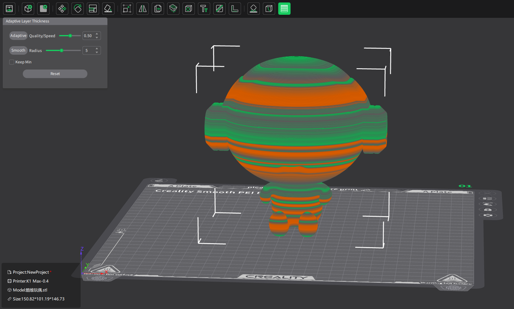  

#### D. Preparación del Archivo (Slicing)
Una vez importado el modelo (en formato STL o 3MF), el proceso sigue este orden profesional:

1.  **Orientación:** Colocar la cara más plana del objeto sobre la cama para maximizar la superficie de contacto.
2.  **Escalado:** Ajustar el tamaño si la pieza excede el tiempo disponible de clase.
3.  **Laminado (Slice):** Al pulsar este botón, el software genera el **G-Code**.
4.  **Vista Previa (Preview):** **Paso obligatorio para el docente.** Permite ver capa por capa cómo se construirá la pieza, identificar posibles zonas de fallo y verificar el tiempo estimado de finalización.

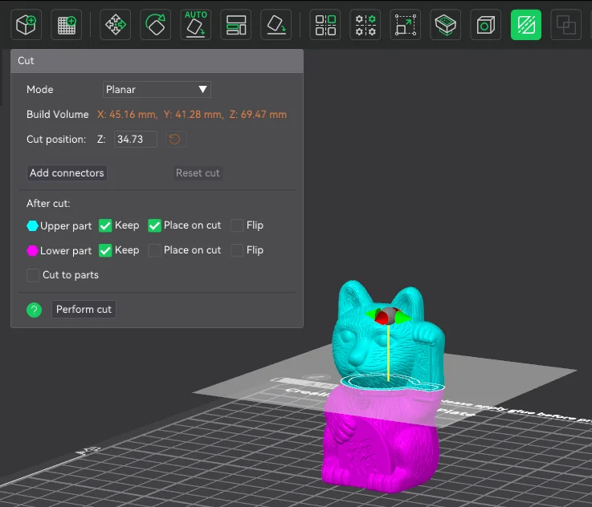  

---

> **Tip Profesional:** En la vista previa, observe el "Caudal" (Flow rate). La K1 brilla cuando el caudal se mantiene constante. Si ve zonas con cambios bruscos de velocidad, considere simplificar la geometría del modelo.

## 3.2. Parámetros Esenciales: Gestión de soportes, rellenos y flujo

Una vez seleccionado el perfil de calidad, el docente debe ajustar tres parámetros críticos que determinan si una pieza tendrá éxito, si será fácil de limpiar por el alumno y si se imprimirá dentro del tiempo de la clase.

---

#### A. Gestión de Soportes: El modelo "Tree" (Árbol)
La K1 imprime muy bien en el aire gracias a su ventilación lateral, pero para ángulos superiores a 45-50° necesitamos soportes.

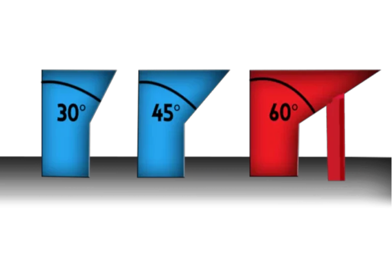  

* **Soportes Normales:** Crean una estructura de rejilla bajo la pieza. Son estables pero difíciles de quitar y dejan marcas.
* **Soportes de Árbol (Tree Supports):** **Altamente recomendados para el aula.** Crecen como ramas desde la placa de impresión hacia la pieza, tocándola mínimamente.
    * **Ventaja:** Se retiran casi sin herramientas, ahorran hasta un 40% de material y reducen el tiempo de post-procesado del alumno.
* **Ángulo de voladizo:** Ajustar a **55°** para que la K1 trabaje más por sí sola y use menos soporte innecesario.

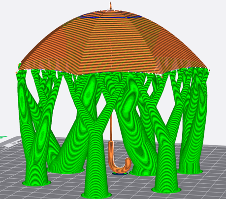  

#### B. Rellenos (Infill): Resistencia vs. Tiempo
El relleno es la estructura interna de la pieza. En educación, el error común es usar rellenos muy altos.

* **Densidad:** Un **10-15%** es suficiente para el 90% de los proyectos escolares.
* **Patrón Gyroid:** Es el patrón más eficiente para la K1. Es fuerte en todas las direcciones y permite que el cabezal se mueva a alta velocidad sin chocar con las líneas de relleno previas (evitando el molesto ruido de "raspado").
* **Relación de tiempo:** Pasar de un 20% a un 10% de relleno puede ahorrar 20 minutos en una impresión de una hora.

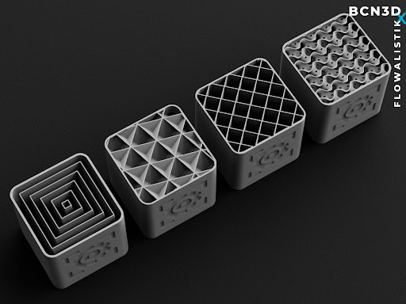  

#### C. Gestión del Flujo (Flow) y Velocidad
La K1 gestiona el flujo de forma inteligente, pero el docente debe supervisar dos aspectos:

* **Paredes (Walls):** Usar **2 o 3 perímetros**. Es más efectivo para la resistencia que subir el relleno.
* **Velocidad de la primera capa:** Aunque la K1 imprime a 600 mm/s, la primera capa debe ir a **30-50 mm/s**. Creality Print lo gestiona solo, pero es vital no "forzar" la velocidad en la base para asegurar la adherencia.

#### D. Adherencia a la placa (Brim y Raft)
* **Brim (Borde):** Una capa fina que rodea la base de la pieza. **Uso obligado** en piezas altas y estrechas para evitar que la inercia de la alta velocidad las tire.
* **Raft (Balsa):** Solo necesario si la base del diseño del alumno es muy irregular. En la K1, gracias a la nivelación automática, el Raft casi nunca es necesario, lo que ahorra mucho material.

---

> **Estrategia para el aula:** Enseñe a los alumnos que "más relleno no siempre es mejor". Un diseño inteligente con soportes de árbol y 3 paredes es más rápido de imprimir y más profesional que un bloque macizo de plástico.

## 3.3. Creality Cloud: Acceso a bibliotecas de modelos y gestión de aula

**Creality Cloud** no es solo un repositorio de archivos; es la plataforma que permite al docente centralizar el trabajo de los alumnos, eliminando el trasiego de tarjetas SD y facilitando la búsqueda de recursos educativos listos para imprimir.

---

#### A. Acceso a la Biblioteca de Modelos
En lugar de diseñar todo desde cero, el docente puede aprovechar miles de recursos ya optimizados:

* **Buscador Integrado:** Acceso directo desde el navegador o la App a modelos categorizados (Ciencias, Ingeniería, Arte).
* **Modelos "Ready-to-Print":** Muchos archivos ya incluyen perfiles de laminación probados por otros usuarios para la K1, lo que reduce el margen de error para el profesor novato.
* **Colecciones Educativas:** Permite guardar modelos en carpetas personalizadas (ej. "Proyecto Geometría 1º ESO") para tenerlos disponibles en cualquier momento.

#### B. Gestión de Impresión Remota (Cloud Printing)
Esta es la herramienta clave para la organización del centro educativo:

* **Carga desde el móvil o PC:** El docente puede seleccionar un modelo en la nube y enviarlo directamente a la K1 sin necesidad de cables.
* **Cola de impresión:** Si la impresora está ocupada, los archivos pueden quedar en espera.
* **Control multi-máquina:** Si el centro dispone de varias K1, desde un solo panel de Creality Cloud se puede decidir en qué máquina imprimir cada proyecto de los alumnos.

#### C. Integración de Alumnos (Gestión de Aula)
Para un flujo de trabajo profesional, se recomienda:

1.  **Cuentas compartidas:** Crear una cuenta de centro donde los alumnos suban sus diseños (formatos STL o 3MF).
2.  **Validación del profesor:** El docente revisa los modelos en la nube, verifica que el tiempo de impresión sea adecuado y autoriza el inicio de la tarea.
3.  **Notificaciones:** El sistema avisa al móvil del docente cuando la impresión ha finalizado o si la IA ha detectado un error.

#### D. Creality M1 e Impacto Ambiental
En la plataforma también se promueven prácticas de **sostenibilidad**:

* **Optimización de material:** Uso de previsualizaciones precisas para evitar impresiones fallidas.
* **Proyectos de reciclaje:** Acceso a modelos específicos para ser impresos con filamento reciclado (conectando con el ecosistema de la recicladora Creality M1).

---

> **Ventaja Estratégica:** Usar la nube permite que la impresora esté en un aula o taller dedicado, mientras el profesor gestiona y supervisa las colas de trabajo desde la sala de profesores o su propio aula de teoría.

## 3.4. Integración con IA: Uso de la cámara para supervisión y funciones inteligentes

La integración de la inteligencia artificial (IA) en la Creality K1 no es una función meramente estética; es una herramienta de **gestión de riesgos** y **eficiencia operativa** para el docente. En este apartado, veremos cómo la cámara se convierte en un asistente que vigila la impresora mientras usted atiende a sus alumnos.

---

#### A. Detección de "Spaghetti" (Detección de fallos en tiempo real)
Es el error más común: una pieza se despega de la base y el extrusor sigue soltando filamento, creando una masa informe de hilos.

* **Funcionamiento:** La IA analiza la imagen de la cámara constantemente. Si detecta patrones que coinciden con una impresión fallida, la máquina se **pausa automáticamente**.
* **Valor educativo:** Evita el desperdicio de metros de filamento y protege el cabezal de impresión de quedar atrapado en una bola de plástico fundido, facilitando la limpieza inmediata y el reinicio de la clase.

#### B. Detección de Objetos Extraños
Antes de comenzar cualquier impresión, la cámara realiza un escaneo de la superficie de la placa PEI.

* **Prevención de daños:** Si la IA detecta que hay una pieza de la clase anterior que no se ha retirado, o una herramienta olvidada, **impedirá el inicio del movimiento**.
* **Importancia en el aula:** Protege la integridad mecánica de la K1 (especialmente la boquilla y los motores del eje Z) frente a descuidos humanos habituales en entornos con muchos usuarios.

#### C. Control de la Primera Capa (Lidar y Cámara)
En el modelo K1 Max o mediante la actualización de la cámara en la K1 estándar, el sistema puede verificar la calidad de la primera capa.

* **Validación técnica:** La IA "mira" si el plástico está bien adherido y si el flujo es el correcto. Si detecta que la base está mal configurada, avisa al docente en los primeros minutos.
* **Ventaja:** El 90% de los fallos ocurren en la primera capa. Saber que la base es sólida permite al docente desviar su atención a otras tareas con total tranquilidad.

#### D. Creación de Contenido Didáctico: Time-Lapse
La cámara graba automáticamente el proceso de construcción, comprimiendo horas de trabajo en pocos segundos.

* **Uso en proyectos:** Los alumnos pueden integrar estos videos en sus memorias de prácticas o presentaciones, mostrando visualmente cómo el diseño digital se materializa.
* **Análisis de errores:** Si una pieza se rompe a mitad de camino, el docente puede revisar el video para entender si fue un error de diseño (paredes muy finas) o un problema térmico.

---

> **Configuración Práctica:** Asegúrese de activar las notificaciones en el software **Creality Print** o la **App Creality Cloud**. De este modo, si la IA detecta un fallo, su teléfono o ordenador emitirá una alerta sonora, permitiéndole actuar sin estar físicamente frente a la máquina.
