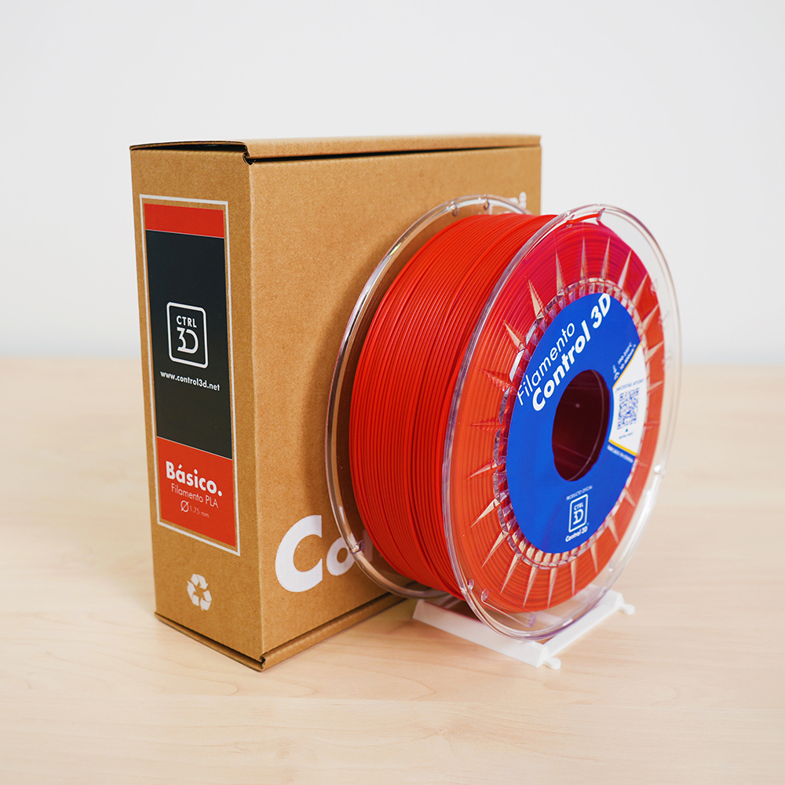
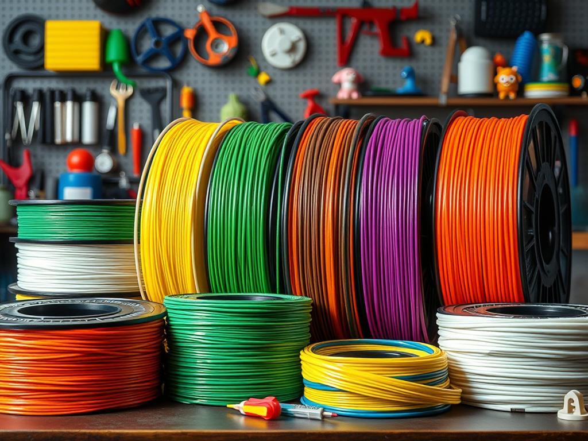
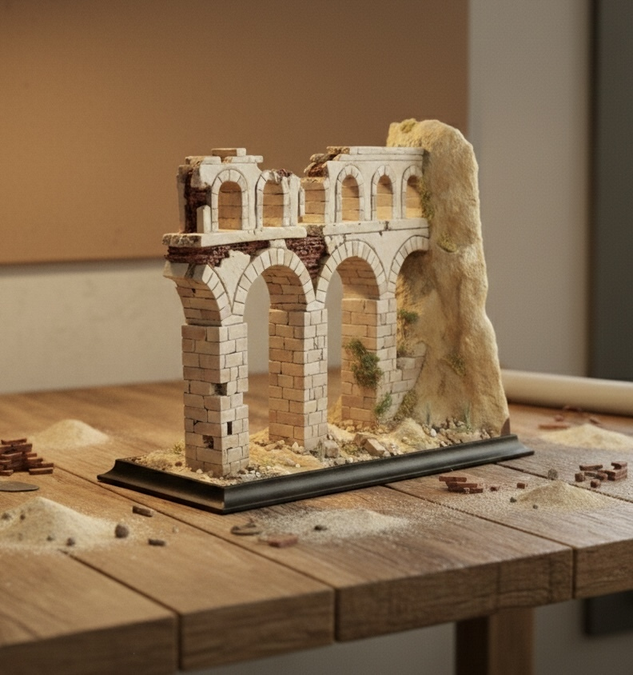
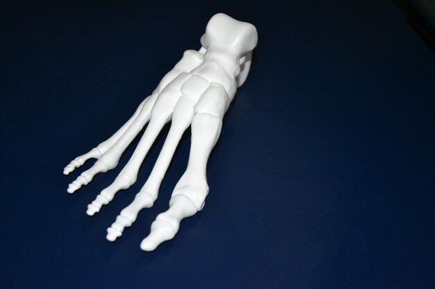
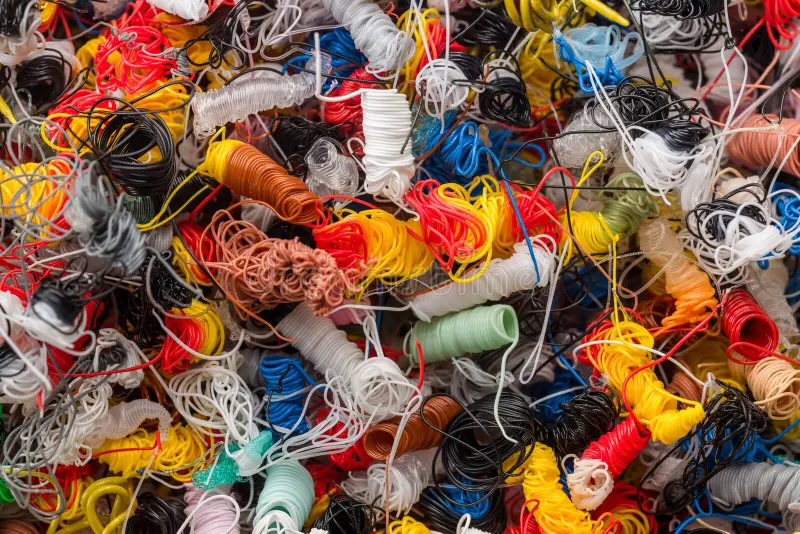
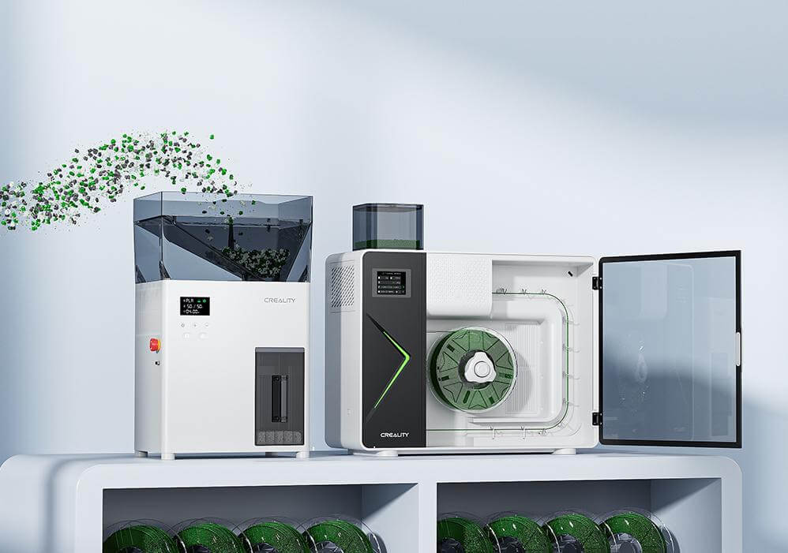

# Módulo 4: Materiales y Aplicaciones Educativas 

Este módulo constituye el núcleo pedagógico del curso. Una vez dominada la técnica y el software, el objetivo es entender cómo la **Creality K1** se convierte en una factoría de soluciones para el centro educativo, optimizando el uso de recursos y fomentando la cultura de la sostenibilidad.

---

## Introducción: Del filamento al aprendizaje significativo

En el contexto escolar, la elección del material y el propósito del objeto impreso definen el éxito de la actividad docente. La Creality K1, gracias a su velocidad y ecosistema, permite que el ciclo de **"Diseñar-Imprimir-Validar"** ocurra con una agilidad nunca antes vista en las aulas.

Este bloque está diseñado para que el docente pueda:

1.  **Seleccionar con criterio:** No todos los proyectos requieren el mismo plástico. Aprenderemos a distinguir cuándo usar los diferentes filamentos para maximizar la velocidad y cuándo recurrir a materiales técnicos o estéticos.
2.  **Materializar el currículo:** Exploraremos cómo la impresión 3D deja de ser una actividad aislada para convertirse en un recurso transversal en asignaturas como Tecnología, Biología, Historia o Matemáticas (STEM).
3.  **Educar en la economía circular:** La fabricación aditiva genera residuos (soportes, pruebas fallidas). Introduciremos el concepto de **sostenibilidad activa** mediante el sistema de reciclado **Creality M1**, cerrando el ciclo del plástico en el propio centro.

## Objetivos del Módulo
* Identificar las propiedades de los distintos filamentos compatibles con la alta velocidad.
* Diseñar estrategias para integrar la impresión 3D en proyectos de medicina, ingeniería y vida diaria.
* Comprender el flujo de reciclaje de restos de impresión para reducir el impacto ambiental y los costes del aula.

---

> **Reflexión para el profesorado:** El material no es solo el consumible; es el soporte físico del conocimiento del alumno. Elegir el adecuado garantiza que el prototipo sea funcional y duradero.

## 4.1. Tipos de Filamento: ¿Qué material elegir?

En la **Creality K1**, la elección del filamento no es solo una cuestión de color, sino de química. Para imprimir a 600 mm/s, el material debe ser capaz de fundirse y enfriarse de forma casi instantánea. La **Creality K1** es una máquina versátil gracias a su extrusor directo y su cámara cerrada. Estos son los materiales más utilizados en el aula:

  

### A. PLA (Ácido Poliláctico)

Es el estándar educativo por excelencia.

* **Uso:** Prototipos, maquetas, figuras y piezas que no deban soportar calor.
* **Ventajas:** El más fácil de imprimir, no huele, es biodegradable y no necesita cama muy caliente.
* **Punto débil:** Se deforma a partir de los **50-60°C** (no lo olvides dentro de un coche al sol).

### B. PETG (Tereftalato de Polietileno Glicol)

El "hermano resistente" del PLA (es el plástico de las botellas de agua).

* **Uso:** Piezas mecánicas, soportes que deban estar en el exterior o piezas con cierta flexibilidad.
* **Ventajas:** Mucho más resistente a los impactos y a la temperatura que el PLA.
* **Punto débil:** Es un poco más "pegajoso" (puede dejar hilos o *stringing*) y requiere temperaturas de boquilla más altas ($230-250°C$).

### C. ABS (Acrilonitrilo Butadieno Estireno)

El material de las piezas de LEGO.

* **Uso:** Piezas técnicas de alta resistencia y que deban soportar mucho calor.
* **Ventajas:** Muy duradero y se puede lijar/mecanizar fácilmente.
* **Punto débil:** Suelta gases nocivos al fundirse y tiende a despegarse de la base (*warping*). 
    * *Nota para la K1:* Gracias a que la K1 es cerrada, el ABS se imprime mucho mejor, pero **siempre se debe usar el filtro de carbón activo y ventilar el aula**.

### D. TPU (Poliuretano Termoplástico)

* **Uso:** Neumáticos de robótica, carcasas de móvil o juntas elásticas.
* **Ventajas:** Es **flexible** (como goma).
* **Punto débil:** Se debe imprimir muy lento. El extrusor directo de la K1 es excelente para este material, evitando que el filamento se enrede.

---

| Material | Dificultad | Temperatura Boquilla | Temperatura Cama | ¿Usa Ventilador? |
| :--- | :--- | :--- | :--- | :--- |
| **PLA** | 🟢 Baja | $190-220°C$ | $45-60°C$ | Sí (100%) |
| **PETG** | 🟡 Media | $230-250°C$ | $70-80°C$ | Sí (30-50%) |
| **ABS** | 🔴 Alta | $240-260°C$ | $90-110°C$ | No / Muy poco |
| **TPU** | 🟡 Media | $220-240°C$ | $30-50°C$ | Sí (20-30%) |

  

---

> **Consejo Docente:** Para el 90% de los proyectos escolares, el **PLA** es la mejor opción por seguridad y tasa de éxito. Reserva el **PETG** para proyectos de tecnología donde las piezas deban "trabajar" mecánicamente.

#### D. Gestión de la humedad
El filamento es higroscópico (absorbe agua del aire). En un centro educativo, un filamento húmedo provocará burbujas y fallos de impresión.

* **Almacenamiento:** Guardar las bobinas en bolsas herméticas con gel de sílice cuando no se usen.
* **Síntomas de humedad:** Chasquidos al imprimir o acabado rugoso en la superficie de la pieza.

---

> **Consejo Directo:** El filamento PLA es el que menos humedad absorbe, pero si se almacena mal (en un aula sin control de clima), incluso el PLA puede degradarse. Es recomendable revisar las bobinas antes de cada proyecto importante.

## 4.2. Proyectos STEM: Aplicaciones en educación, medicina y vida diaria

La alta velocidad de la Creality K1 (600 mm/s) transforma la impresora de ser un "escaparate" a ser una herramienta de producción real en el aula. Lo que antes requería dejar la máquina encendida toda la noche, ahora puede suceder durante una sesión doble de clase.

---

#### A. Aplicaciones en Educación y Ciencias (STEM)
* **Matemáticas y Geometría:** Visualización de cuerpos geométricos complejos, fractales o funciones topológicas. Los alumnos pueden diseñar e imprimir sus propios manipulativos para entender volúmenes y áreas.
* **Física e Ingeniería:** Impresión de componentes para robótica (engranajes, poleas, chasis de vehículos). La precisión de la K1 permite que las piezas mecánicas encajen con tolerancias profesionales.
* **Historia y Patrimonio:** Reproducción de artefactos arqueológicos o maquetas de edificios históricos a partir de escaneos 3D, permitiendo que los alumnos interactúen con la historia de forma táctil.

  

#### B. Medicina y Biología: Modelado Realista
Gracias a la capacidad de la K1 para manejar detalles finos, se pueden abordar proyectos de salud:
* **Anatomía:** Impresión de réplicas de huesos o modelos de órganos (corazón, pulmones) basados en datos de resonancias reales. Esto facilita la comprensión de la escala y la complejidad biológica.
* **Prótesis de bajo coste:** Colaboración con proyectos sociales para imprimir prótesis de manos funcionales. La resistencia del **Hyper PLA** y la fiabilidad de la K1 la hacen ideal para estas aplicaciones de impacto social.

  

#### C. Vida Diaria y Resolución de Problemas
El enfoque "Maker" enseña a los alumnos a detectar necesidades en su entorno:

* **Organizadores y Útiles:** Diseño de soportes para material de laboratorio, organizadores de escritorio personalizados o carcasas para proteger placas electrónicas (Arduino/Raspberry Pi).
* **Reparaciones:** Fomentar la sostenibilidad mediante la impresión de piezas de repuesto para objetos rotos del centro (pomos de puertas, clips de pizarras), reduciendo el desperdicio.

#### D. Flujo de Diseño Colaborativo (Onshape)
Para maximizar estos proyectos, se recomienda integrar la K1 con plataformas de diseño en la nube como **Onshape**:

* **Trabajo en Equipo:** Los alumnos pueden colaborar en el mismo diseño desde diferentes dispositivos (incluso tablets).
* **Integración Directa:** Una vez finalizado el diseño en Onshape, se exporta a **Creality Print** para su fabricación inmediata en la K1.

---

> **Idea para el Aula:** Organice un "Reto de Diseño de 60 Minutos". Dado que la K1 es extremadamente rápida, los alumnos pueden diseñar un objeto pequeño, imprimirlo y probarlo dentro de la misma clase, permitiendo un ciclo de aprendizaje de "prueba y error" en tiempo real.

## 4.3. Sostenibilidad: Introducción al sistema de reciclado de filamento Creality M1

En un entorno educativo donde se generan múltiples prototipos, pruebas y soportes descartados, la gestión de residuos es una oportunidad pedagógica para enseñar economía circular. El ecosistema **Creality M1** se integra como la solución para cerrar el ciclo del plástico en el aula.

---

#### A. De Residuo a Recurso: El concepto "Zero Waste"
Tradicionalmente, las impresiones fallidas o los soportes de las piezas terminaban en el contenedor de basura. Con el sistema de reciclado, el centro educativo puede implementar un protocolo de recuperación:

* **Recolección:** Clasificación de restos de **PLA** (el material más común en escuelas) en contenedores específicos.
* **Transformación:** El sistema Creality M1 permite procesar estos restos para convertirlos de nuevo en bobinas de filamento utilizables por la K1.

  

#### B. Funcionamiento del Ecosistema M1 & R1
Para que el reciclaje sea efectivo, el proceso se divide en etapas técnicas sencillas:

1.  **Triturado (Grinder):** Los fallos de impresión y soportes se introducen en una trituradora que los convierte en "pellets" o pequeñas virutas de plástico.
2.  **Extrusión (M1):** Estas virutas se funden y se extruyen a través de una boquilla de precisión para crear un hilo de diámetro constante (1.75 mm).
3.  **Bobinado (R1):** Un sistema sincronizado enrolla el nuevo filamento en una bobina vacía, listo para volver a ser cargado en la Creality K1.

  

#### C. Valor Educativo y Concienciación
Integrar este sistema en el proyecto curricular permite trabajar competencias transversales:

* **Responsabilidad Ambiental:** Los alumnos ven de primera mano el impacto de sus diseños y aprenden que el plástico es un recurso valioso, no un desperdicio.
* **Ciencia de Materiales:** Comprensión de las propiedades térmicas de los polímeros y cómo la degradación térmica afecta al número de veces que un plástico puede reciclarse.
* **Optimización de Recursos:** Análisis del ahorro de costes para el centro educativo al reducir la compra de bobinas vírgenes.

#### D. Mejores Prácticas para el Reciclaje en el Aula
* **Pureza del material:** Es vital no mezclar tipos de plástico (ej. no mezclar PLA con PETG o TPU), ya que contaminaría el nuevo filamento y causaría atascos en la K1.
* **Limpieza:** Asegurarse de que los restos no tengan restos de pegamento, pintura o grasa de manos para garantizar la calidad de la nueva bobina.
* **Mezcla de colores:** Una actividad creativa interesante es mezclar restos de diferentes colores para obtener filamentos con tonalidades únicas o marmoleadas.

---

> **Reflexión para el centro:** Implementar una "Estación de Reciclado" junto a la K1 convierte el aula de tecnología en un laboratorio de fabricación sostenible real, alineado con los Objetivos de Desarrollo Sostenible (ODS).

