# Módulo 5: Post-procesado y Acabados

La impresión 3D no termina cuando el cabezal de la **Creality K1** regresa a su posición de origen. El post-procesado es la etapa donde transformamos un objeto de plástico en bruto en un producto final funcional, estético o educativo. 

## Introducción: El valor del detalle final

En el entorno escolar, el post-procesado es una fase crítica del aprendizaje. Mientras que la K1 se encarga de la fabricación de alta precisión, el alumno se encarga del refinamiento. Esta etapa permite:

1.  **Corregir Imperfecciones:** Eliminar las estructuras de soporte necesarias para la impresión pero ajenas al diseño original.
2.  **Mejorar la Estética:** Ocultar las líneas de capa naturales de la tecnología FDM mediante técnicas de abrasión y recubrimiento.
3.  **Ensamblar Proyectos Complejos:** Unir piezas que, por su tamaño o geometría, han sido impresas por separado, fomentando el pensamiento lógico y la visión espacial.
4.  **Desarrollar Habilidades Manuales:** El uso de herramientas de corte, lijado y pintura complementa la formación digital con destreza física.

Un buen post-procesado puede salvar una pieza con pequeños errores estéticos y elevar la calidad de un proyecto STEM al nivel de un prototipo profesional. En este módulo, aprenderemos a realizar estas tareas de forma segura y eficiente dentro del aula.

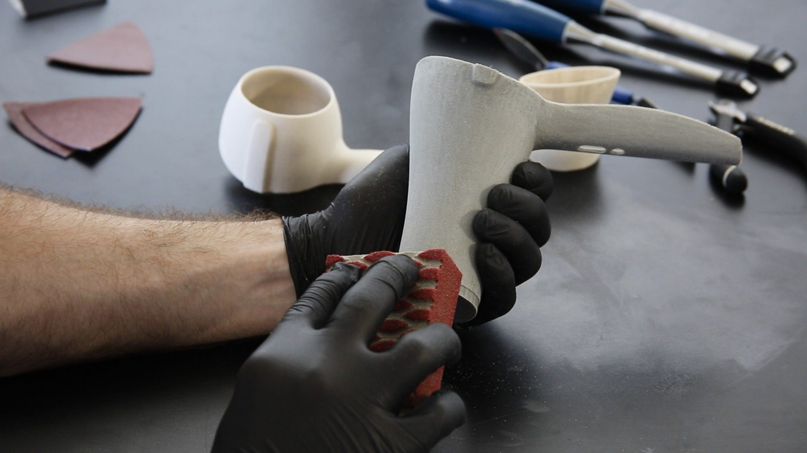  

---

> **Nota para el docente:** Es fundamental establecer una "zona de acabado" en el taller, separada de las impresoras, para evitar que el polvo del lijado o los vapores de los adhesivos afecten a la mecánica de precisión de la K1.

## 5.1. Retirada de Soportes: Herramientas y técnicas para no dañar la pieza

En la Creality K1, debido a su alta velocidad, las estructuras de soporte pueden compactarse más de lo habitual. Una retirada descuidada no solo puede dejar marcas estéticas (cicatrices), sino que puede romper partes funcionales del diseño del alumno.

---

### A. Herramientas Esenciales del "Kit de Post-procesado"
Para trabajar con seguridad en el aula, cada estación de trabajo debería contar con:

* **Alicates de corte lateral (incluidos con la K1):** Son la herramienta principal. Su cara plana permite cortar el soporte a ras de la pieza.
* **Pinzas de punta fina:** Ideales para alcanzar soportes en cavidades internas o zonas estrechas donde los dedos no llegan.
* **Espátula metálica y flexible:** Útil para separar la base del soporte de la placa PEI antes de empezar a desgranar la pieza.
* **Gafas de seguridad:** **Obligatorias.** El PLA es un material rígido; al saltar, los restos de soporte pueden ser proyectados hacia los ojos con fuerza.

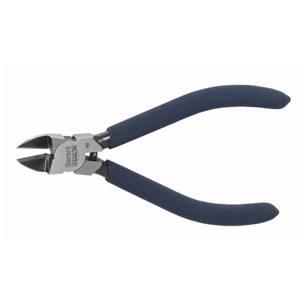  

### B. Técnicas según el tipo de soporte
* **Soportes Orgánicos/Árbol (Tree):** 
  
    * *Técnica:* No tire con fuerza bruta. Gire la estructura de "tronco" del soporte. Al ser huecos y ramificados, suelen colapsar sobre sí mismos y desprenderse en grandes bloques.
    *  *Punto de contacto:* Si quedan pequeños puntos unidos a la pieza, córtelos con el alicate en lugar de arrancarlos para evitar el "pitting" (pequeños agujeros en la superficie).
    * 
* **Soportes Lineales/Normales:**
    * *Técnica:* Use el alicate para "morder" las esquinas del soporte y debilitar la estructura. Una vez que una esquina se suelta, el resto suele salir en forma de acordeón.

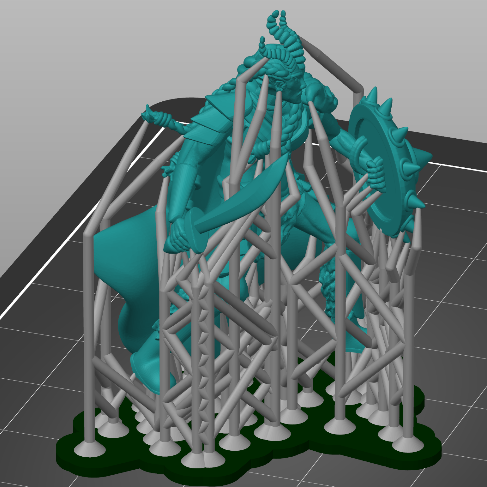  

### C. El "Secreto" de la Temperatura
El PLA se vuelve más quebradizo cuando está frío. 

* **Truco para el docente:** Si un soporte está especialmente rebelde, use un **decapador térmico** o un secador de pelo a baja temperatura durante unos segundos sobre la zona. El plástico se ablandará ligeramente, permitiendo que el soporte se retire "como si fuera chicle", evitando roturas en la pieza principal.

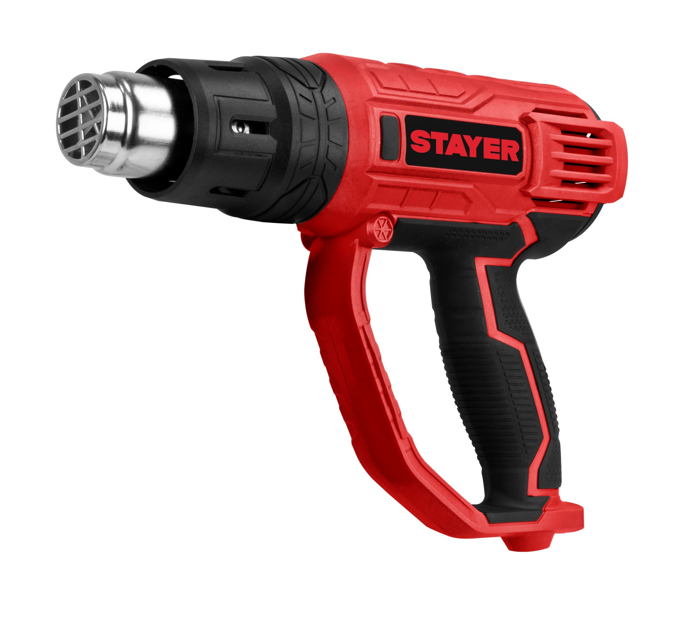  

#### D. Prevención: La "Distancia Z" en el Laminador
Para minimizar el trabajo en este apartado, asegúrese de que en el software **Creality Print** el parámetro **"Top Contact Z Distance"** esté configurado entre **0.2 mm y 0.25 mm**. 

* Si es menor, el soporte se soldará a la pieza.
* Si es mayor, el soporte no sostendrá nada y la pieza saldrá mal.

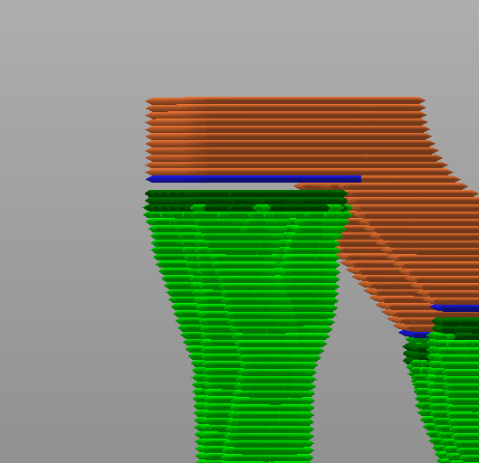  

---

> **Regla de oro para el alumno:** "Corta el soporte, no la pieza". Siempre es mejor dejar un milímetro de soporte y lijarlo después que intentar cortarlo a ras y llevarse un trozo del diseño original por delante.

## 5.2. Tratamiento de Superficies: Lijado, imprimación y técnicas de pintura para el aula

Una vez retirados los soportes, la pieza presentará marcas de fabricación (líneas de capa) y puntos de contacto. El tratamiento de superficies es el proceso de "maquillado" técnico que otorga a la pieza un acabado profesional.

---

### A. El Arte del Lijado (Sanding)
El PLA es un termoplástico, lo que significa que si lo lijas muy rápido, el calor por fricción lo derretirá en lugar de pulirlo.

* **Lijado en húmedo:** Esta es la técnica clave. Sumergir la lija en agua o mojar la pieza evita que el plástico se caliente y que el polvo fino quede en suspensión (manteniendo el aula limpia de microplásticos).
* **Granulometría Progresiva:**
    * **Grano 120-220:** Para eliminar restos de soportes y escalones evidentes.
    * **Grano 400:** Para unificar la superficie.
    * **Grano 600 o superior:** Solo si se busca un acabado suave al tacto antes de pintar.

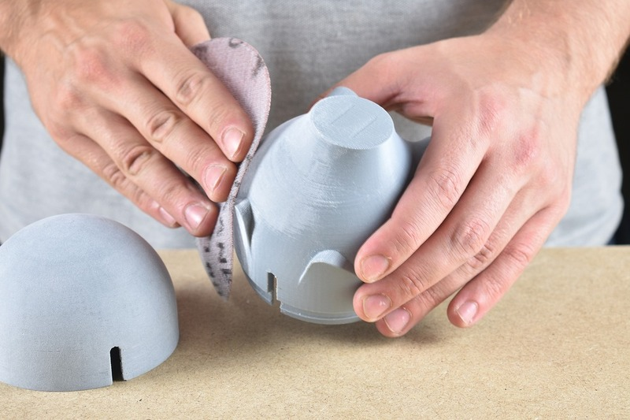  

### B. Imprimación: Rellenando los surcos
La impresión 3D FDM siempre deja micro-valles entre capas. Para eliminarlos sin lijar durante horas, usamos la **imprimación de relleno (Filler Primer)**:

* **Función:** Es una pintura espesa que se deposita en los huecos.
* **Aplicación:** Se aplican 2 o 3 capas finas. Una vez seca, se realiza un lijado suave (grano 400). Verás cómo la imprimación se queda en los valles y desaparece en las crestas, dejando la superficie totalmente lisa.
* **Seguridad:** En el colegio, esto debe hacerse en una **zona ventilada** o en una cabina de pintura con filtro, usando mascarilla.

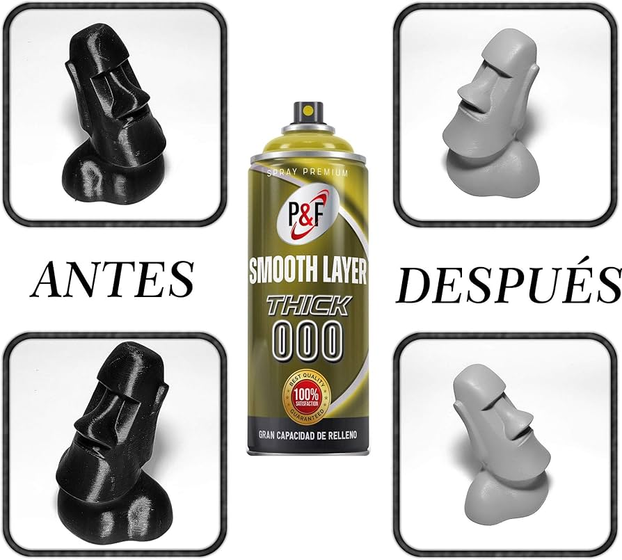  

### C. Pintura y Color
Para proyectos escolares, la seguridad es lo primero:

* **Pinturas Acrílicas:** Son las mejores para el aula. No son tóxicas, se diluyen en agua y se adhieren perfectamente al PLA imprimado.
* **Rotuladores Posca/Acrílicos:** Excelentes para que los alumnos dibujen detalles sobre las piezas impresas sin necesidad de pinceles o botes de pintura, reduciendo las manchas en el mobiliario.
* **Spray:** Ofrece un acabado más uniforme (tipo industrial), pero requiere mayor control y protecciones.

### D. Acabado con Calor (Heat Gun)
A veces, tras el post-procesado, el PLA puede presentar zonas blanquecinas por el esfuerzo mecánico. 

* **Técnica:** Una pasada rápida (1-2 segundos) con una pistola de aire caliente devolverá el color original al plástico y eliminará cualquier hilo (*stringing*) microscópico que haya quedado tras la impresión a alta velocidad.

---

> **Consejo para el Docente:** Organiza una "estación de lijado" con bandejas de agua. Esto no solo facilita el trabajo, sino que contiene los residuos de plástico en un solo lugar, permitiendo su correcta gestión posterior.

## 5.3. Unión de Piezas: Adhesivos adecuados para diferentes filamentos

Debido a que la Creality K1 tiene un volumen de impresión de $250 \times 250 \times 250$ mm, muchos proyectos de gran envergadura (como maquetas de arquitectura, prótesis a escala real o chasis de robótica) deberán imprimirse por partes. La unión de estas piezas es un paso crítico para garantizar la resistencia estructural del conjunto.

---

### A. Cianoacrilato (Super Glue): El estándar para PLA
Es el adhesivo más utilizado en el aula por su rapidez y fuerza.

* **Funcionamiento:** Crea una unión química casi instantánea con el **PLA**.
* **Técnica:** Aplica el pegamento en una sola cara. Para piezas que no encajan perfectamente, puedes usar un **acelerador en spray** en la otra cara para que la unión sea inmediata.
* **Limitación:** Es muy rígido. Si la pieza va a recibir impactos o debe ser flexible, la unión podría cristalizar y romperse.

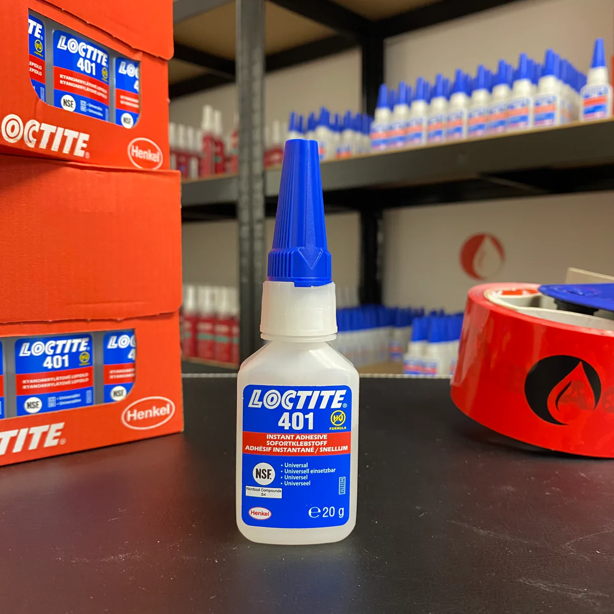  

### B. Pegamento de Poliuretano o Epoxi (Bicomponente)
Ideal para proyectos de ingeniería donde la resistencia es la prioridad.

* **Epoxi:** Consiste en una resina y un endurecedor. Es excelente para rellenar huecos si las piezas han sufrido una ligera contracción.
* **Uso:** Requiere mezcla previa y un tiempo de curado de al menos 5-10 minutos, lo que permite al alumno ajustar la posición de las piezas antes de que se fijen definitivamente.

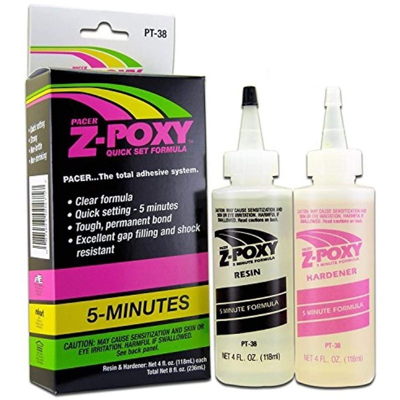  

### C. Soldadura por Fricción o Calor
Una técnica avanzada y muy económica que aprovecha los restos de filamento:

* **Dremel/Herramienta rotativa:** Se coloca un trozo pequeño de filamento en el mandril de la herramienta. Al girar a altas revoluciones, el calor por fricción funde el filamento y la pieza, creando una soldadura plástica real.
* **Pirograbador o Soldador:** A baja temperatura, se puede fundir ligeramente la unión y "coserla" con un poco de filamento adicional. Es la unión más fuerte posible, aunque requiere un lijado posterior (4.2).

### D. Diseño de Uniones Mecánicas (Ensambles)
La mejor unión es la que viene integrada desde el diseño digital:

* **Pins y Agujeros:** Incluir pequeños cilindros y huecos en las caras de unión para asegurar que las piezas se alineen perfectamente antes de pegar.
* **Cola de milano / Pestañas:** Diseñar encajes que no necesiten pegamento, lo que permite que el proyecto sea desmontable y facilita el aprendizaje sobre tolerancias y ajustes mecánicos.

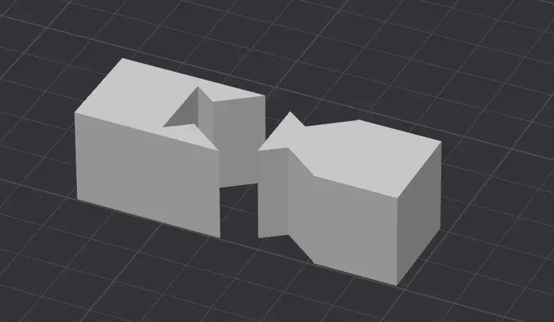  

---

> **Seguridad en el aula:** Al trabajar con cianoacrilato, es vital el uso de guantes de nitrilo y evitar el contacto con los ojos. Si se utiliza la técnica de soldadura por calor, debe hacerse bajo supervisión directa para evitar quemaduras y en zonas bien ventiladas para no inhalar los vapores del plástico fundido.

## 5.4. Limpieza y Toques Finales: El control de calidad

El último paso del post-procesado no consiste en añadir, sino en **perfeccionar**. En esta etapa, el alumno realiza el control de calidad final para asegurar que la pieza sea funcional y segura para su manipulación.

---

### A. Eliminación de "Pelos" (Stringing)
A pesar de la excelente retracción de la K1, al imprimir a 600 mm/s pueden aparecer hilos microscópicos, especialmente si el filamento ha absorbido algo de humedad.

* **La técnica del soplete/encendedor:** Pasar una llama rápida (menos de 1 segundo) por la superficie de la pieza. El calor desintegra los hilos finos sin llegar a deformar la estructura principal.
* **Pistola de aire caliente:** Es la opción más segura para el aula. Ajustada a **150°C - 200°C**, elimina el *stringing* y devuelve el brillo a las zonas que se hayan quedado blanquecinas tras retirar los soportes.

### B. Limpieza de Residuos de la Cama (Adhesivos)
Si se ha utilizado laca o pegamento en barra sobre la placa PEI para asegurar la adherencia:

* **Lavado con agua y jabón:** El PLA es resistente al agua. Un lavado rápido elimina los restos de adhesivo de la base de la pieza.
* **Alcohol Isopropílico (IPA):** Para eliminar huellas dactilares o restos de grasa antes de la pintura final. **Nota:** El alcohol puede dejar el PLA mate si se frota en exceso.

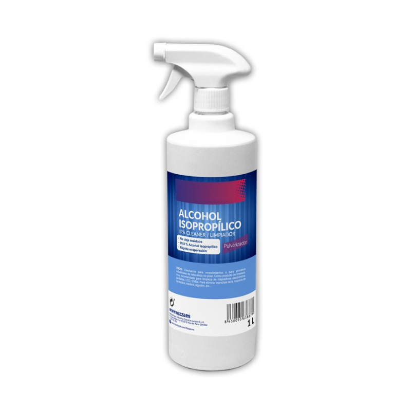  

### C. Ajuste de Tolerancias Mecánicas
En proyectos de ingeniería, es común que los ejes o engranajes encajen un poco "apretados" debido a la expansión térmica del plástico.

* **Escariado manual:** Usar una broca o una lima redonda para repasar los agujeros donde deban pasar ejes.
* **Lubricación:** Para mecanismos funcionales impresos en la K1, una pequeña gota de grasa de litio o aceite de silicona marcará la diferencia entre un juguete que se atasca y una máquina que funciona suavemente.

### D. Verificación de Seguridad (Uso Escolar)
Antes de entregar el proyecto o darlo por finalizado, el alumno debe verificar:

* **Aristas cortantes:** Comprobar que no hayan quedado rebabas de plástico duro que puedan cortar.
* **Estabilidad:** Asegurarse de que las uniones pegadas en el paso 4.3 han curado totalmente y son estructuralmente seguras.

---

> **Checklist del Alumno:** Una buena práctica es tener una lista de verificación en el taller:
> 1. ¿He quitado todos los soportes?
> 2. ¿He eliminado los hilos con calor?
> 3. ¿La pieza encaja donde debería?
> 4. ¿He limpiado mi zona de trabajo?
