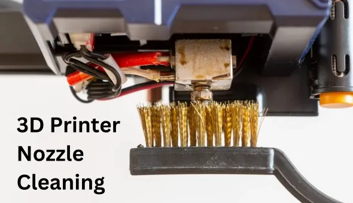
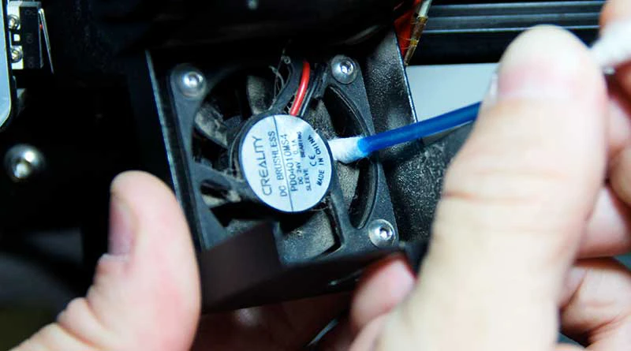
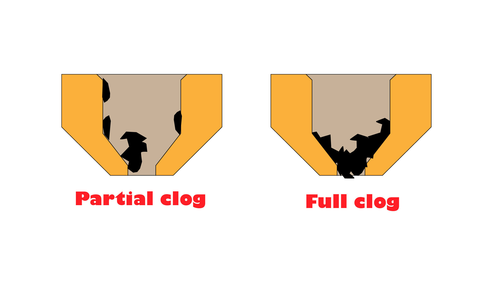
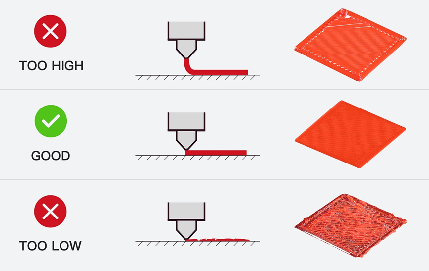
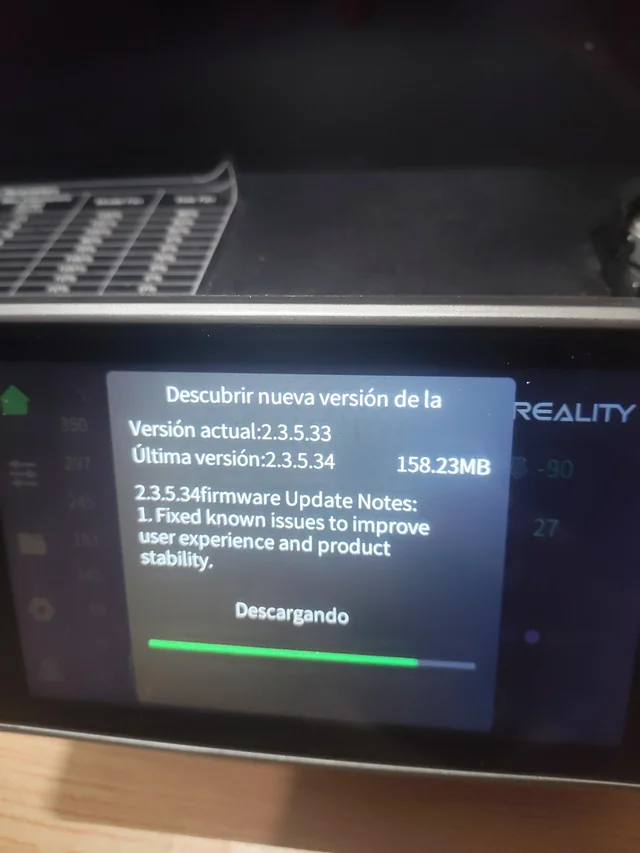

# Módulo 6: Mantenimiento y Resolución de Problemas

Incluso una máquina de alto rendimiento como la **Creality K1** requiere cuidados periódicos para mantener su velocidad y precisión. En un entorno educativo, donde la impresora puede trabajar varias horas al día de la mano de diferentes usuarios, el mantenimiento preventivo es la clave para evitar tiempos de inactividad.

---

## Introducción: La cultura del cuidado técnico

Este módulo no trata solo de reparar la máquina cuando falla, sino de integrar el **mantenimiento preventivo** como parte del currículo de aprendizaje técnico. El objetivo es que la impresora esté siempre lista para la siguiente clase y que el docente sepa reaccionar ante los imprevistos más comunes.

Para la Creality K1, el mantenimiento se divide en tres niveles:

1.  **Mantenimiento Diario:** Acciones rápidas tras cada impresión para asegurar la salud de la máquina.
2.  **Mantenimiento Periódico:** Limpieza de ejes y calibración para evitar ruidos y pérdida de precisión.
3.  **Resolución de Problemas (Troubleshooting):** Diagnóstico rápido de fallos comunes como atascos o errores de nivelación.

## Objetivos del Módulo
* Prolongar la vida útil de la K1 mediante protocolos de limpieza específicos para sistemas **CoreXY**.
* Identificar y solucionar problemas de extrusión y adherencia de forma autónoma.
* Aprender a gestionar las actualizaciones de **Firmware** para mantener la IA y las funciones de red al día.
* Establecer un calendario de revisiones técnicas para el centro educativo.

---

> **Filosofía del Taller:** "Una impresora limpia es una impresora que no falla". Enseñar a los alumnos a limpiar la base y revisar el extrusor al finalizar su turno fomenta la responsabilidad y el respeto por las herramientas comunes.

## 6.1. Mantenimiento Preventivo: Ejes, lubricación y boquilla

La **Creality K1** es una máquina de alta velocidad que genera fuerzas de inercia considerables. Para que el sistema **CoreXY** siga siendo silencioso y preciso, es vital realizar una rutina de mantenimiento básico. Sin fricción no hay desgaste.

---

### A. Limpieza y Lubricación de los Ejes
A diferencia de otras impresoras, la K1 utiliza barras lineales que deben deslizarse suavemente:

* **Ejes X e Y (Barras de acero):** * **Limpieza:** Use un paño seco que no suelte pelusa para eliminar el polvo y los restos de filamento que se acumulan en las barras. 
    * **Lubricación:** Aplique una gota de **aceite de silicona** o lubricante específico para impresoras 3D cada 200 horas de uso (o una vez al mes). Deslice el cabezal manualmente con la máquina apagada para distribuir el aceite.
* **Ejes Z (Varillas roscadas):**
    * Limpie la grasa vieja que puede haber atrapado polvo y aplique una capa fina de **grasa de litio**. Esto evitará las vibraciones horizontales (*z-banding*) en las piezas de los alumnos.

  

### B. Mantenimiento del Hotend y la Boquilla
La boquilla es el punto de mayor estrés térmico.

* **Limpieza Exterior:** Con la boquilla caliente (**200°C**), use un cepillo de latón para eliminar los restos de plástico pegado. **Cuidado:** No use cepillos de acero, ya que pueden dañar el bloque calentador o los cables.
* **Cold Pull (Tirón en frío):** Si nota que el flujo de plástico es irregular, realice un *cold pull* con filamento de limpieza o PLA para extraer impurezas del interior de la boquilla sin desmontarla.
* **Apriete en Caliente:** Tras muchas horas de vibración, es recomendable verificar que la boquilla esté bien apretada (siempre realizándolo con la boquilla a **240°C** para evitar roturas).

  

### C. Limpieza de la Placa o cama de Construcción (PEI)
Una placa sucia es la causa del 80% de las impresiones fallidas en el aula.

* **Protocolo diario:** Limpiar con **alcohol isopropílico** y un paño para quitar la grasa de las manos de los alumnos.
* **Limpieza profunda:** Si las piezas dejan de pegarse, lave la placa con **agua templada y jabón lavavajillas neutro**. El jabón elimina aceites que el alcohol a veces solo extiende.
* **Evitar daños:** Nunca use espátulas metálicas de forma agresiva; podría rayar el recubrimiento de PEI y arruinar la textura de la base de las piezas.

### D. Inspección de Ventiladores y Correas
* **Ventiladores:** El ventilador lateral de la K1 mueve mucho aire y puede absorber hilos de plástico. Use aire comprimido para mantener las aspas limpias y evitar sobrecalentamientos.
* **Tensión de Correas:** Las correas deben estar tensas como una cuerda de guitarra. Si al imprimir círculos estos salen ovalados, es momento de ajustar los tensores traseros de la máquina.

  

---

> **Consejo del Docente:** Cree una "Hoja de Vida de la Impresora" pegada junto a la K1. Cada vez que un alumno o profesor lubrique los ejes o limpie la boquilla, debe anotar la fecha. Esto crea el hábito de mantenimiento industrial en los estudiantes.

## 6.2. Solución de Problemas Comunes: Atascos, nivelación y extrusión

Incluso con una máquina tan avanzada como la K1, el uso intensivo en el aula puede presentar desafíos técnicos. Saber diagnosticar el origen del problema ahorra horas de frustración y evita intervenciones innecesarias en el hardware.

---

### A. Atascos en el Extrusor (Clogging)
Es el problema más frecuente y suele ocurrir por apagar la impresora antes de que el hotend se enfríe o por usar filamentos de mala calidad.

* **Síntomas:** El extrusor hace un ruido de "clic-clic" (salto de pasos), no sale filamento o las capas salen incompletas (subextrusión).
* **Solución Rápida:** Caliente la boquilla a **260°C** e intente empujar filamento manualmente usando la palanca del extrusor. Si no fluye, use la **aguja de limpieza** incluida para desbloquear la punta.
* **Solución Profunda:** Si el atasco es severo, la K1 permite retirar el conjunto del extrusor con solo tres tornillos. Verifique que no haya un trozo de filamento doblado en los engranajes *Sprite*.

  

### B. Problemas de Adherencia y Nivelación
Aunque la K1 tiene nivelación automática por sensores de fuerza, a veces la primera capa no es perfecta.

* **Z-Offset:** Si la boquilla está muy alta (el plástico no se pega) o muy baja (la boquilla raya la placa), ajuste el **Z-Offset** desde la pantalla táctil mientras se imprime la primera capa. Un ajuste de apenas **0.05 mm** puede ser la diferencia entre el éxito y el fracaso.
* **Efecto Warping:** Si las esquinas de la pieza se levantan, asegúrese de que el ventilador lateral no esté al 100% desde la primera capa y verifique que no haya corrientes de aire frío en el aula.

  

### C. Errores de la IA y Sensores
A veces la cámara IA puede dar "falsos positivos".

* **Lente sucia:** Si la IA pausa la impresión sin motivo aparente, limpie la lente de la cámara con un paño de microfibra. El polvo de las impresiones puede empañarla.
* **Error de sensor de filamento:** Si la máquina dice que no hay filamento pero la bobina está llena, verifique que el hilo no esté excesivamente tenso o que el sensor no tenga restos de polvo plástico en su interior.

### D. Calibración de Input Shaping (Vibraciones)
Si nota "fantasmas" o ecos en las paredes de las piezas (*ghosting*):

* **Re-calibración:** Ejecute la función de **Autocalibración** desde el menú de configuración. La K1 realizará una serie de vibraciones controladas para medir las resonancias de los ejes y compensarlas mediante software. Esto es esencial tras mover la impresora de sitio o ajustar las correas.

---

## Tabla de Diagnóstico Rápido

| Síntoma | Causa probable | Solución sugerida |
| :--- | :--- | :--- |
| **Clic del extrusor** | Atasco o temperatura baja | Subir temperatura 10°C o limpiar boquilla |
| **Pieza despegada** | Placa sucia o Z-Offset alto | Lavar placa con jabón y bajar Z-Offset |
| **Hilos (Stringing)** | Filamento húmedo o calor | Secar filamento o bajar temp. de impresión |
| **Círculos ovalados** | Correas flojas | Tensar correas traseras |

---

> **Estrategia Pedagógica:** Cuando ocurra un error, no lo solucione usted solo. Llame a un grupo de alumnos y realicen el diagnóstico juntos. Convertir un fallo en una "clase de ingeniería forense" es una de las mejores formas de aprender cómo funcionan realmente las máquinas.

## 6.3. Actualizaciones de Firmware y Conectividad: Manteniendo la K1 al día

La Creality K1 es más parecida a un ordenador que a una herramienta tradicional. Su sistema operativo basado en **Creality OS** recibe mejoras constantes que optimizan la velocidad, la precisión de la IA y la estabilidad de la red.

---

### A. ¿Por qué es crítico actualizar el Firmware?
En un entorno educativo, mantener el software de la máquina actualizado no es opcional, ya que cada versión suele incluir:

* **Optimizaciones de Velocidad:** Ajustes en los algoritmos de aceleración para reducir el tiempo de impresión sin perder calidad.
* **Mejoras en la IA:** Refinamiento de la detección de fallos (evitando falsos positivos de la cámara).
* **Seguridad de Red:** Parches para garantizar que la conexión Wi-Fi del centro sea estable y segura.
* **Nuevas Funciones:** A menudo se añaden menús de calibración más intuitivos o compatibilidad con nuevos materiales.

### B. Métodos de Actualización
Existen dos formas principales de actualizar la K1:

1.  **Vía OTA (Over-the-Air):** Si la impresora está conectada al Wi-Fi del centro, aparecerá un punto rojo en el icono de "Configuración". Es tan sencillo como pulsar "Update" y esperar a que la máquina se reinicie.
2.  **Vía USB:** Si el centro tiene restricciones de red (Firewalls), se debe descargar el archivo `.img` desde la web oficial de Creality, copiarlo a la raíz de un pendrive e insertarlo en la impresora. El sistema lo detectará automáticamente al encenderse.
   
  

### C. Gestión de la Red Escolar (Wi-Fi y LAN)
La conectividad permite al docente monitorizar la clase desde su mesa.

* **Modo LAN:** Es la opción más estable. Permite enviar archivos directamente desde **Creality Print** a la impresora sin pasar por internet, ideal si la conexión externa del colegio es lenta.
* **IP Estática:** Se recomienda configurar una IP fija para la impresora en el router del centro. Así, el software del docente siempre encontrará la máquina en la misma "dirección digital".
* **Web Dashboard:** Introduciendo la dirección IP de la K1 en cualquier navegador (Chrome, Edge), se accede a un panel de control avanzado donde se puede ver la cámara en pantalla completa y ajustar temperaturas en tiempo real.

### D. Seguridad de Datos
* **Privacidad de la Cámara:** Asegúrese de informar que la cámara solo es accesible por los usuarios vinculados a la cuenta de Creality Cloud del centro o dentro de la red local.
* **Cuentas de Usuario:** Se recomienda que solo el docente tenga el control total ("Admin") de la impresora para evitar que alumnos borren archivos de otros compañeros o cambien configuraciones críticas de fábrica.

---

> **Aviso Importante:** Nunca apague la impresora ni retire el pendrive durante un proceso de actualización de firmware. Esto podría corromper el sistema operativo y requerir una recuperación técnica compleja.

## 6.4. Calendario de Revisiones Técnicas: Organización del taller

Para asegurar que la **Creality K1** esté siempre operativa para la siguiente clase, es fundamental pasar de un modelo de "reparar cuando se rompa" a uno de **mantenimiento programado**. Un calendario visual junto a la impresora permite que tanto docentes como alumnos avanzados participen en el cuidado del equipo.

---

### A. Rutina Diaria (Responsabilidad del Alumno/Usuario)
Estas tareas deben realizarse al finalizar cada sesión de impresión:

* **Limpieza de la placa PEI:** Pasar un paño con alcohol isopropílico para eliminar huellas.
* **Inspección de la cámara:** Verificar que la lente no tenga polvo para que la IA funcione correctamente.
* **Vaciado de restos:** Retirar los hilos o trozos de plástico que caen en el fondo de la cámara de impresión para evitar que bloqueen los ventiladores.

### B. Revisión Mensual (Responsabilidad del Docente o Encargado de Taller)
Una vez al mes (o cada 200 horas de uso), se debe dedicar 15 minutos a:

* **Lubricación de ejes:** Aplicar aceite de silicona en las barras X e Y y grasa de litio en los husillos Z.
* **Tensión de correas:** Comprobar visualmente que las correas no presentan deshilachados y que mantienen la tensión adecuada.
* **Limpieza de ventiladores:** Usar aire comprimido para limpiar el ventilador de capa y el ventilador del hotend.

### C. Mantenimiento Trimestral / Semestral (Puesta a punto profunda)
Coincidiendo con los periodos de vacaciones o evaluaciones, se recomienda:

* **Inspección del extrusor:** Desmontar la tapa del extrusor *Sprite* para limpiar posibles restos de filamento triturado en los engranajes.
* **Sustitución de boquilla:** Si la calidad de superficie ha bajado notablemente, cambiar la boquilla por una nueva para recuperar la precisión original.
* **Actualización y Backup:** Verificar versiones de firmware y realizar una limpieza de la memoria interna de la impresora (borrar archivos de proyectos antiguos finalizados).

---

### Ejemplo de Cuadro de Mantenimiento para el Aula

| Frecuencia | Tarea | Responsable | Estado |
| :--- | :--- | :--- | :---: |
| **Diaria** | Limpieza de Placa PEI | Alumno | [ ] |
| **Mensual** | Lubricación de Ejes X/Y/Z | Docente | [ ] |
| **Trimestral** | Calibración *Input Shaping* | Docente | [ ] |
| **Semestral** | Cambio de Boquilla (Nozzle) | Técnico/Docente | [ ] |

---

> **Consejo del Mes:** Involucre a los alumnos en la revisión mensual. Asignar el rol de "Jefe de Mantenimiento" a un alumno diferente cada mes fomenta el sentido de propiedad y cuidado del material público, además de proporcionarles conocimientos de mecánica real.

